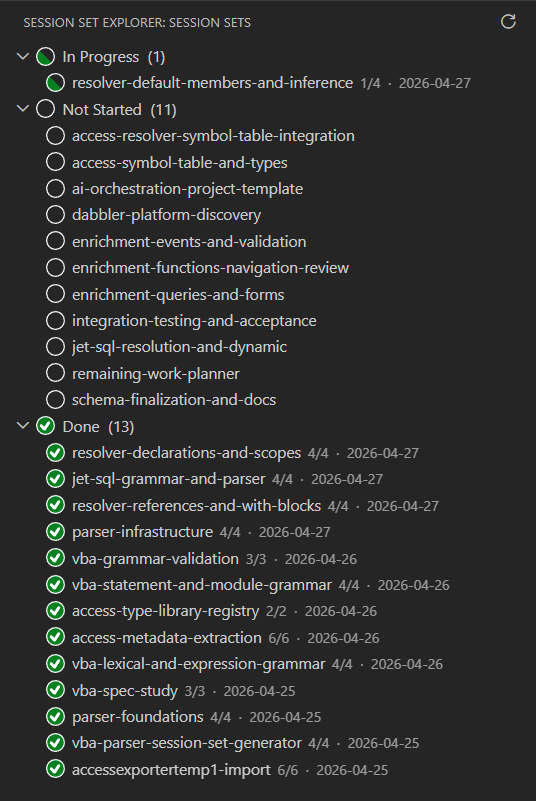

# dabbler-ai-orchestration

Canonical home for shared AI orchestration infrastructure across all
Dabbler AI-led-workflow repos. Two pieces ship from here:

- **`ai-router/`** — a Python module that routes reasoning tasks across
  Anthropic, Google, and OpenAI models, runs cross-provider verification,
  and tracks costs per session set.
- **`tools/vscode-session-sets/`** — the **Session Set Explorer** VS Code
  extension, an activity-bar tree view of session-set state.

Consumer repos (`dabbler-access-harvester`, `dabbler-platform`, …) sync
the `ai-router/` source from here and install the extension VSIX from
here. This repo is the source of truth; consumer repos do not maintain
their own forks of either piece.

---

## Table of contents

- [What this repo is for](#what-this-repo-is-for)
- [Highlighted features](#highlighted-features)
- [The Session Set Explorer in action](#the-session-set-explorer-in-action)
- [Prerequisites: tools and accounts](#prerequisites-tools-and-accounts)
- [Installing the VS Code extension (the reliable way)](#installing-the-vs-code-extension-the-reliable-way)
- [Adopting `ai-router` in a project](#adopting-ai-router-in-a-project)
- [Repos that need UAT and/or E2E support — and repos that don't](#repos-that-need-uat-andor-e2e-support--and-repos-that-dont)
- [End-of-session output (worked example)](#end-of-session-output-worked-example)
- [Repository file map](#repository-file-map)
- [License](#license)

---

## What this repo is for

The orchestration pattern is documented in full at
[docs/ai-led-session-workflow.md](docs/ai-led-session-workflow.md). At a
glance:

1. The human triggers a session with one of the canonical phrases
   (`Start the next session.`, `Start the next session of <slug>.`,
   `Start the next parallel session of <slug>.`, optionally suffixed with
   `— maxout <engine>`).
2. An **orchestrator** (Claude Code, Codex, or Gemini) executes one
   session of work. The orchestrator does mechanical file edits and
   shell calls itself, but every reasoning task — code review, security
   review, analysis, architecture, documentation, test generation, and
   the mandatory end-of-session verification — is dispatched through
   `ai_router.route()`.
3. The router picks the cheapest capable model per task type, escalates
   on poor responses, and runs cross-provider verification on
   security-sensitive task types automatically.
4. Every routed call is appended to `ai-router/router-metrics.jsonl` so
   per-set, per-task, and per-model spend is fully auditable.
5. Each session ends with a commit + push + a Pushover notification (if
   configured) that includes the next-orchestrator recommendation.

The Session Set Explorer extension is the **at-a-glance** companion to
this workflow. It reads the same files the router writes
(`spec.md`, `session-state.json`, `activity-log.json`, `change-log.md`,
the per-set UAT checklist) and renders three groups in the activity
bar: **In Progress**, **Not Started**, **Done**.

---

## Highlighted features

### 1. Work is organized into session sets and sessions

The unit-of-execution is a **session**: one bounded slice of work that
runs to completion in a single orchestrator conversation, ends with a
verification + commit, and stops. Sessions exist because that is how
AI-coding-agent work is naturally bounded — context windows, attention,
and rate limits all push toward "do one thing thoroughly, then stop."

The unit-of-planning is a **session set**: an ordered sequence of
sessions that together deliver one feature, refactor, or aspect of the
solution. Most non-trivial work needs more than one session, so a set
is the artifact a human and AI co-design **out of band** before any
session runs. The set's `spec.md` carries the per-session step lists,
the configuration block (`requiresUAT` / `requiresE2E`), and the
prerequisite chain. Each set lives in its own directory under
`docs/session-sets/<slug>/` and produces a small, predictable set of
artifacts (`spec.md`, `session-state.json`, `activity-log.json`,
`ai-assignment.md`, `session-reviews/`, end-of-set `change-log.md`,
and — when opted in — `<slug>-uat-checklist.json`).

The Session Set Explorer (screenshot below) renders the active inventory
across all session sets in the workspace. Authoring rules and slug
conventions live in [docs/planning/session-set-authoring-guide.md](docs/planning/session-set-authoring-guide.md);
runtime mechanics live in [docs/ai-led-session-workflow.md](docs/ai-led-session-workflow.md).

### 2. Cost-minded orchestration

Inside each session, work is split between an **orchestrator** AI and
the **router**. The orchestrator is a coding-assistant agent running
inside VS Code with bounded read/write/execute access to the file
system; it owns mechanics (file edits, shell, git) and dispatch. Four
orchestrator agents are supported, each reading its own instruction
file at the repo root: Claude Code reads [CLAUDE.md](CLAUDE.md),
Codex (OpenAI) and GitHub Copilot read [AGENTS.md](AGENTS.md), and
Gemini Code Assistant reads [GEMINI.md](GEMINI.md). All three files
describe the same role and rules — only the agent-specific bootstrap
(API key export syntax, etc.) differs. The router (`ai-router/`) owns
reasoning: code review, security review, analysis, architecture,
documentation, test generation, and the mandatory end-of-session
verification all go to `route()`, which estimates complexity, picks the
cheapest capable tier, and applies per-task-type effort overrides from
[ai-router/router-config.yaml](ai-router/router-config.yaml).

Assignment planning happens at **two cadences**:

- **Whole-set authoring at the start of Session 1** (Step 3.5 in the
  workflow doc). The orchestrator routes a full pass over the spec's
  per-session step lists and writes `ai-assignment.md` — a per-session
  ledger naming the cheapest capable model + effort for each step.
- **Per-session refresh at Step 8** of every non-final session. The
  orchestrator routes a fresh recommendation for the *next* session
  based on this session's actuals, and appends both to
  `ai-assignment.md`.

Both passes use `task_type="analysis"` — the orchestrator never
self-opines on which model is cheaper (Rule #17). A Claude orchestrator
asked freely will recommend Claude; routing the analysis through a
different provider removes that bias.

A model-tier and pricing reference (Gemini Flash → Gemini Pro / Sonnet /
GPT-5.4 Mini → Opus / GPT-5.4) lives in
[docs/ai-led-session-workflow.md → Model Tiers and Pricing](docs/ai-led-session-workflow.md#model-tiers-and-pricing).

### 3. Cross-provider verification

Every session ends with a **mandatory** independent verification by a
model from a **different provider** than the one that did the work
(Step 6). This catches provider-specific blind spots and biases — and
it is non-negotiable: `session-verification` always routes, even under
the `— maxout <engine>` suffix that lifts every other cost cap.

Verifier selection in [ai-router/verification.py](ai-router/verification.py)
is rule-based: different provider, enabled as a verifier, matches the
generator's tier (or one tier higher), cheapest output price wins. The
verifier returns a structured JSON verdict
(`{"verdict": "VERIFIED" | "ISSUES_FOUND", "issues": [...]}`) so the
result is parseable rather than a free paragraph.

When the orchestrator **disagrees** with a finding, it does not
unilaterally dismiss it and does not poll a second AI for a vote. The
authority model is *verifiers flag, humans adjudicate.* The
orchestrator surfaces the finding, the dismissal reason, the context
that went to the verifier, and a self-assessment of whether relevant
context was missing. The human then picks one of four resolutions:

- (a) accept the finding and fix it,
- (b) accept the dismissal and close it,
- (c) **re-verify with reshaped context** (same verifier, add missing
  files / trim irrelevant ones — resolves the most common case where
  the verifier just wasn't shown enough),
- (d) **second opinion from a different provider** (tiebreaker model
  from outside the original verifier's provider).

Each adjudication is logged via `record_adjudication()` so the
distribution of (a)/(b)/(c)/(d) across sessions becomes visible in the
manager report and informs router-config tuning.

### 4. Git integration and parallel session sets

Every session ends with `git add -A && git commit && git push`. There
is no manual step for the human between verification and the commit
landing on `main`. Session set status is then flipped to `complete` in
`session-state.json` so the Session Set Explorer (and any external
dashboard) updates immediately.

Two or more session sets can run **in parallel** when the human's
out-of-band plan establishes that they don't conflict on the same
files. The trigger phrase
`Start the next parallel session of <slug>.` runs the session in an
isolated git worktree at `../<repo>-<slug>` on a `session-set/<slug>`
branch. The set's last session merges `origin/main` back into the
session-set branch (resolving conflicts), then merges into main and
pushes — so parallel sets converge cleanly without the human shuffling
worktrees by hand. The Session Set Explorer's worktree auto-discovery
surfaces in-progress sessions running in sibling worktrees of the same
repo, so a parallel session shows up in the activity bar even when its
worktree isn't opened as a separate workspace folder.

### 5. Batching and robust fallbacks

Outsourced calls fail. The framework treats failure as expected
behavior, not an exception:

- **Tier escalation.** If a tier-1 response is empty, truncated, or
  refused, the router escalates to the next tier (up to two
  escalations). Detection includes the `detect_truncation()` helper in
  [ai-router/utils.py](ai-router/utils.py) — a hard-won workaround for
  Gemini Pro returning `stop_reason: "end_turn"` on visibly cut-off
  responses (see [docs/planning/lessons-learned.md](docs/planning/lessons-learned.md)).
- **Two-attempt verifier fallback.** If the first-choice verifier fails
  at the HTTPS layer (provider outage, timeout, garbled response), the
  router excludes that provider and re-picks once. The fallback is
  flagged in metrics with `verifier_fallback: true` so the audit trail
  reflects the verifier that actually ran.
- **Verifier-failure escalation ladder.** If both verifier attempts
  fail, the orchestrator follows a documented ladder:
  retry same provider once → fall back to remaining cross-provider
  verifier → **decompose the prompt into smaller requests** → verify
  against the description-of-work → log a Major issue and proceed to
  commit. The work is preserved in git for human review either way.
- **Cost guard on verification.** When a cheap tier-1 generator pulls
  an expensive tier-3 verifier, the savings collapse. The router skips
  verification (and records `verification_skipped: cost_guard`) when
  verifier cost would exceed `max_cost_multiplier × generator cost`.
  Session-verification is exempt — that one is non-negotiable.

### 6. UAT checklist editor integration with E2E pre-screening

For session sets that opt in with `requiresUAT: true`, the orchestrator
authors `<slug>-uat-checklist.json` during the set, matching the schema
at the [UAT checklist editor repo](https://github.com/darndestdabbler/uat-checklist-editor/blob/main/checklist-schema.json).
The human runs the checklist through the freely-available editor at
[darndestdabbler.github.io/uat-checklist-editor](https://darndestdabbler.github.io/uat-checklist-editor/),
which writes review results back inline into the same JSON file.
Pending human review **blocks downstream sessions** unless the human
explicitly overrides (Rule #9), so review feedback can't get lost in
the gap between sessions.

The crucial layer is what runs **before** the human ever sees the
checklist. When a set declares both `requiresUAT: true` AND
`requiresE2E: true`, every functional checklist item must have matching
Playwright coverage (same action, same parameters, same assertions),
and the `uat-coverage-review` task type returns `VERIFIED` only when
that parity holds. Items whose expectation is purely a judgment call
(layout feel, copy quality, aesthetics) are flagged
`IsJudgmentItem: true` with a one-sentence justification; they're
exempt from matching-test parity but still need a sequence-reachability
test so the human is rendering judgment on a verified-live UI rather
than debugging exceptions. **Human UAT is the second line of defense,
not the first** — most regressions never reach the human because the
E2E gate already caught them.

### Other features worth knowing

- **Append-only metrics log + manager report.** Every routed call,
  verifier call, tiebreaker call, and adjudication writes one JSON line
  to `ai-router/router-metrics.jsonl`, spanning every session set in
  the repo. `python -m ai_router.report` produces a markdown summary
  with total spend, the **Opus-only-baseline savings headline** (what
  the same token volume would have cost if every call had gone to
  Opus), per-task-type unreliability rates, top outliers, and
  auto-generated action items for any task type whose composite
  unreliability exceeds 20%.
- **Pushover end-of-session notifications.** When `PUSHOVER_API_KEY` /
  `PUSHOVER_USER_KEY` are set, the orchestrator sends a phone push at
  Step 8 with the session number, verification verdict, and one-line
  summary. The notify happens *before* the optional Step 9
  reorganization-proposals review so the human is never blocked on
  reviewing proposals to receive the "session complete" signal.
- **Self-improving guidance.** On the **last session** of every set,
  the orchestrator reviews [docs/planning/lessons-learned.md](docs/planning/lessons-learned.md)
  and [docs/planning/project-guidance.md](docs/planning/project-guidance.md)
  and proposes promotions: a lesson applied as the right call in two
  or more contexts can be promoted to a Convention; a Convention whose
  rationale has become strategic can be promoted to a Principle.
  Nothing is ever deleted — items only move, with rationale.
- **Provider-agnostic orchestrator handoff.** The
  `activity-log.json` + `spec.md` + `session-state.json` triple carries
  enough state that any of the four supported orchestrators can pick
  up where another left off. The human can run Session 1 with Claude
  Code, Session 2 with Codex or GitHub Copilot, and Session 3 with
  Gemini Code Assistant — switching mid-set requires no migration step.

---

## The Session Set Explorer in action

Below is the extension running in a real Dabbler workspace. Three
session sets show: one in-progress (with current session, orchestrator,
and pending-UAT badge in the description column), two complete, several
not-started.



State is derived from file presence, mirroring
`ai_router.find_active_session_set()`:

| Files present | State |
|---|---|
| `change-log.md` | done |
| `activity-log.json` *or* `session-state.json` | in-progress |
| only `spec.md` | not-started |

`session-state.json` is the **earliest in-progress signal** — written at
Step 1 of every session (before any activity-log entry exists), so a
freshly-started set flips to In Progress immediately.

For the full feature list of the extension (worktree auto-discovery,
UAT badges, Playwright reveal, the various copy-as-trigger-phrase
commands, the `dabblerSessionSets.*` settings), see
[tools/vscode-session-sets/README.md](tools/vscode-session-sets/README.md).

---

## Prerequisites: tools and accounts

You need three things before this framework is useful: **VS Code**, at
least one **orchestrator agent** installed as a VS Code extension, and
**API-key accounts** for all three model providers (the router needs
all three so cross-provider verification has somewhere to route to).
Links to the canonical online resources for each:

### VS Code

- **Download VS Code:** [code.visualstudio.com](https://code.visualstudio.com/) — pick the installer for your OS.
- **Getting-started docs:** [code.visualstudio.com/docs](https://code.visualstudio.com/docs) — covers installing extensions, settings, the integrated terminal, and the command palette. The Extensions view (`Ctrl+Shift+X` / `Cmd+Shift+X`) is what you'll use to install the Session Set Explorer in the next section.

### Orchestrator agents (install at least one)

Pick whichever AI agent you want to drive sessions. You can install
more than one and switch mid-set — the framework is provider-agnostic
(see the *Provider-agnostic orchestrator handoff* feature above).

- **Claude Code (Anthropic)** — reads [CLAUDE.md](CLAUDE.md).
  - Product page and install instructions: [claude.com/product/claude-code](https://www.claude.com/product/claude-code)
  - Documentation: [docs.claude.com/en/docs/claude-code/overview](https://docs.claude.com/en/docs/claude-code/overview)
  - The VS Code extension is installed automatically the first time you run `claude` inside VS Code's integrated terminal. It can also be found on the marketplace by searching "Claude Code."
- **Codex (OpenAI)** — reads [AGENTS.md](AGENTS.md).
  - OpenAI Codex page: [openai.com/codex](https://openai.com/codex/)
  - Open-source CLI repo (also installs the IDE integration): [github.com/openai/codex](https://github.com/openai/codex)
- **GitHub Copilot** — reads [AGENTS.md](AGENTS.md).
  - Product page and plans: [github.com/features/copilot](https://github.com/features/copilot)
  - Quickstart: [docs.github.com/en/copilot/quickstart](https://docs.github.com/en/copilot/quickstart)
  - VS Code extension: search "GitHub Copilot" in the Extensions view, or install from [the marketplace listing](https://marketplace.visualstudio.com/items?itemName=GitHub.copilot).
- **Gemini Code Assist (Google)** — reads [GEMINI.md](GEMINI.md).
  - Product page: [codeassist.google](https://codeassist.google/) (a free tier is available).
  - Documentation: [cloud.google.com/gemini/docs/codeassist/overview](https://cloud.google.com/gemini/docs/codeassist/overview)
  - VS Code extension: search "Gemini Code Assist" in the Extensions view.

### API-key accounts (all three required for the router)

The router calls all three providers — Anthropic for Claude
Sonnet/Opus, Google for Gemini Flash/Pro, OpenAI for GPT-5.4 / GPT-5.4
Mini — and cross-provider verification needs at least two providers
live to be meaningful. In practice, expect to set up all three.

- **Anthropic Console** — for `ANTHROPIC_API_KEY` (Claude Sonnet, Opus):
  [console.anthropic.com](https://console.anthropic.com/). Sign up,
  add billing, create a key under *Settings → API Keys*.
- **Google AI Studio** — for `GEMINI_API_KEY` (Gemini Flash, Pro):
  [aistudio.google.com](https://aistudio.google.com/). The free tier
  is generous; the *Get API key* button is in the left rail. Google
  Cloud billing is only required for higher rate limits.
- **OpenAI Platform** — for `OPENAI_API_KEY` (GPT-5.4, GPT-5.4 Mini):
  [platform.openai.com](https://platform.openai.com/). Create a
  project, add a payment method, then mint a key at
  [platform.openai.com/api-keys](https://platform.openai.com/api-keys).

Set each key as a Windows User environment variable (the
agent-bootstrap snippets in [CLAUDE.md](CLAUDE.md) /
[AGENTS.md](AGENTS.md) / [GEMINI.md](GEMINI.md) read them via
PowerShell on session start). On macOS / Linux, export them in your
shell profile.

### Optional: Pushover for end-of-session phone notifications

- [pushover.net](https://pushover.net/) — sign up for an account,
  install the mobile app, and create an application. Set
  `PUSHOVER_API_KEY` (the application token) and `PUSHOVER_USER_KEY`
  (your user key) in the same place as the model API keys.

If Pushover is not configured the orchestrator skips the notify and
prints the cost report and stop message to the console as usual — no
errors, no degraded behavior.

---

## Installing the VS Code extension (the reliable way)

The VSIX ships from this repo. Use the Extensions-view "..." menu —
it's the most reliable method across VS Code versions and avoids the
PATH/`code` CLI quirks of `code --install-extension`.

1. **Pull this repo** (or the `tools/vscode-session-sets/` directory) so
   you have the VSIX file locally:
   `tools/vscode-session-sets/dabbler-session-sets-0.8.0.vsix`.
2. In VS Code, open the **Extensions** view: `Ctrl+Shift+X`
   (or `View → Extensions`).
3. Click the **`...`** (More Actions) menu in the top-right corner of
   the Extensions view.
4. Choose **`Install from VSIX...`**.
5. Browse to and select
   `tools/vscode-session-sets/dabbler-session-sets-0.8.0.vsix`.
6. When prompted, **Reload** the window.
7. Open any workspace that contains `docs/session-sets/`. The
   activity-bar icon **Session Set Explorer** appears automatically.

> The extension auto-activates on `workspaceContains:docs/session-sets`,
> so there is no enable-step. Open a workspace without that folder and
> the icon stays hidden.

### Building the VSIX from source (rare — only when bumping the version)

```bash
cd tools/vscode-session-sets
npm install
npx vsce package
```

That writes a fresh `dabbler-session-sets-<version>.vsix` next to
`package.json`. Install it via the **`...`** menu as above.

---

## Adopting `ai-router` in a project

The router is a plain Python package. To bring it into a consumer repo:

1. **Copy `ai-router/` to the root of the consumer repo.** It is a
   self-contained directory with no implicit relative paths above its
   own root. Consumer repos own their copy; this repo is the source of
   truth that they sync from when changes land.

2. **Set API keys as environment variables:**

   | Variable | Required for |
   |---|---|
   | `ANTHROPIC_API_KEY` | Claude Sonnet / Opus calls |
   | `GEMINI_API_KEY` | Gemini Flash / Pro calls |
   | `OPENAI_API_KEY` | GPT-5.4 / GPT-5.4 Mini calls |
   | `PUSHOVER_API_KEY` | (optional) end-of-session phone notifications |
   | `PUSHOVER_USER_KEY` | (optional) end-of-session phone notifications |

   On Windows, set these as User environment variables; the notification
   helper falls back to the Windows User/Machine environment if the
   process environment doesn't already have the Pushover keys.

3. **Create the venv and install runtime deps:**

   ```bash
   python -m venv .venv
   .venv/Scripts/pip install pyyaml httpx
   ```

   The router uses `httpx` directly for all three providers' HTTP APIs
   (no `openai` / `anthropic` / `google-genai` SDKs needed at runtime).

4. **Import the router from your orchestrator script.** Because the
   directory is hyphenated (`ai-router/`), Python can't import it as a
   package name directly. Use `importlib`:

   ```python
   import importlib.util, sys

   def load_ai_router():
       spec = importlib.util.spec_from_file_location(
           "ai_router", "ai-router/__init__.py",
           submodule_search_locations=["ai-router"])
       mod = importlib.util.module_from_spec(spec)
       sys.modules["ai_router"] = mod
       spec.loader.exec_module(mod)
       return mod

   ar = load_ai_router()
   route = ar.route
   ```

5. **Tune `ai-router/router-config.yaml`** for the project. This is
   where you set per-task-type effort levels, the cost guard for
   verification, and the `delegation.always_route_task_types` list that
   prevents the orchestrator from doing reasoning work itself. The YAML
   is the single source of truth — there is no separate overlay file.

6. **Author your first session set:** create
   `docs/session-sets/<slug>/spec.md` with a Session Set Configuration
   block (see [docs/planning/session-set-authoring-guide.md](docs/planning/session-set-authoring-guide.md)),
   and start it with `Start the next session.`.

---

## Repos that need UAT and/or E2E support — and repos that don't

> **Universal core, gated extensions, addendum specifics.** Anything in
> the core works unmodified when `requiresUAT: false` and
> `requiresE2E: false` are permanent defaults. UI/UAT/E2E behavior is
> gated on spec-level flags.

Two flags in each spec's `## Session Set Configuration` YAML block
control opt-in:

```yaml
requiresUAT: false
requiresE2E: false
uatScope: none      # per-session | per-set | none
```

The matrix:

| Repo type | Flags | What runs / what is gated |
|---|---|---|
| **Console / library / CLI / no-UI repo.** Examples: a pure refactor repo, a Python data tool, an internal SDK. | `requiresUAT: false`, `requiresE2E: false` (or block omitted entirely — same effect) | Universal core only: build, test, cross-provider verification, commit, notify. The router never invokes `uat-plan-generation` or `uat-coverage-review`. The Session Set Explorer renders each set as a minimal entry — no UAT badge, no UAT/E2E commands, no Playwright lookup. |
| **Repo with E2E coverage but no human UAT.** Examples: a service whose behavior is fully testable end-to-end without human judgment. | `requiresUAT: false`, `requiresE2E: true` | Behavioral changes must ship with matching Playwright coverage; the orchestrator confirms via test discovery before notifying. No UAT checklist is built. The *Reveal Playwright Tests for This Set* command appears in the extension's right-click menu. |
| **Repo with human UAT but no E2E framework.** Examples: legacy UIs not yet wired to Playwright. | `requiresUAT: true`, `requiresE2E: false` | The orchestrator authors `<slug>-uat-checklist.json` during the set, the human runs it via the [UAT checklist editor](https://darndestdabbler.github.io/uat-checklist-editor/), pending review blocks downstream sessions (Rule #9). The extension shows `[UAT n]` / `[UAT done]` badges. The E2E coverage gate is skipped. |
| **Full-stack UI repo.** Examples: `dabbler-platform` and equivalent Blazor/React apps. | `requiresUAT: true`, `requiresE2E: true` | Full gating: every functional checklist item must have matching Playwright coverage and pass `uat-coverage-review` before the checklist is committed and the human is notified. Judgment items (`IsJudgmentItem: true` in the checklist JSON) are exempt from matching-test parity but still need a sequence-reachability test. |

### Hard-disabling UAT/E2E surfaces in the extension

For a repo that should **never** see UAT/E2E commands in the palette
even if a stray spec accidentally turns the flag on, set the
extension's two enablement settings to `never`:

```jsonc
// .vscode/settings.json
{
  "dabblerSessionSets.uatSupport.enabled": "never",
  "dabblerSessionSets.e2eSupport.enabled": "never"
}
```

The defaults (`auto` for both) already keep these surfaces hidden until
at least one spec opts in — so most consumer repos need no settings at
all. The third setting, `dabblerSessionSets.e2e.testDirectory`, lets
E2E-bearing repos point the *Reveal Playwright Tests* command at a
specific subdirectory (e.g. `tests/MyApp.Playwright`) instead of
searching all of `tests/`.

### Deciding the flags for a *new* spec

The When-UAT-Is-Required and When-E2E-Is-Required heuristics live in
[docs/planning/session-set-authoring-guide.md](docs/planning/session-set-authoring-guide.md).
Spec authors decide; the orchestrator obeys. If a flag turns out wrong
mid-set, correct the spec and revisit at the Step 9 reorganization
review — never override at runtime.

---

## End-of-session output (real example)

The stop message at Step 10 is the human-readable summary the
orchestrator prints in the chat after committing and pushing. It rolls
up the verification verdict, deferred issues, the routed cost summary
for this session, the build/test result, what's left in the set, the
**routed** next-orchestrator recommendation, and the commit hash. Below
is a verbatim Step 10 message from a real Session 1 of 4:

> **Session 1 of 4 — `resolver-default-members-and-inference`**
>
> - **Verification verdict:** VERIFIED (Round 2; high confidence,
>   2 minor doc fixes applied)
> - **Deferred issues:** None — all 7 findings across 2 rounds were
>   fixed in-session
> - **Cost summary:** $0.278 routed (4 calls: gemini-pro × 2 = $0.014,
>   gpt-5-4 × 2 = $0.264). Synthesis itself was in-conversation
>   ($0 routed).
> - **Build/test:** dotnet build green; full test suite 995 passed,
>   2 skipped (Windows-only), 0 failed. Resolver tests: 247 passed
>   (+27 new in `DefaultMembers/`).
> - **Sessions remaining:** 3 (Session 2: Type Inference synthesis;
>   Session 3: Cross-Reference Index; Session 4: Cross-cut +
>   mechanical tightening).
> - **Recommended next orchestrator:** `claude-opus-4-7` @ effort=high
>   (routed via gemini-pro analysis — Session 2 has the same
>   architecture-synthesis complexity profile as this one).
> - **Commit:** `784e7d9` pushed to main.
>
> Wait for the human before starting Session 2.

A few things worth noticing in this real example:

- **Two verification rounds.** Round 1 turned up 7 findings; the
  orchestrator fixed each, then Round 2 returned VERIFIED. The
  `Deferred issues: None` line is the human-readable assertion that
  no Major or Critical finding is being carried forward — Rule #6
  forbids committing with unresolved Major/Critical issues.
- **Synthesis was in-conversation.** Most of the session's reasoning
  was done by the orchestrator directly because it met the Delegation
  Discipline criteria for direct work. Routed cost is only the four
  `route()` calls — two `gemini-pro` analysis calls and two `gpt-5-4`
  cross-provider verification calls.
- **Routed next-orchestrator recommendation.** The orchestrator did
  not pick `claude-opus-4-7` itself. It routed the analysis through
  `gemini-pro` (Rule #17) and reported what came back. The rationale
  ("same architecture-synthesis complexity profile") came from that
  routed analysis, not from self-opinion.
- **Commit already pushed.** The session's work is on `main` before
  the stop message renders. There is no manual git step between the
  human seeing this output and the change being shareable.

Three other artifacts are produced alongside this stop message:

- **Console cost-report banner** from `print_cost_report()`
  ([ai-router/__init__.py:767](ai-router/__init__.py#L767)) — sessions
  completed/remaining, total calls, total cost, per-model breakdown.
- **Pushover notification** (if configured) — title
  `Session complete: <slug>`, body containing the session number,
  verdict, and one-line summary. Sent *before* the optional Step 9
  reorganization review so the human is never blocked on it.
- **Appended block in `ai-assignment.md`** — the actuals for this
  session and the routed next-orchestrator recommendation, persisted
  in the session-set folder for future sessions to read.

On the **last session** of a set, the stop message additionally points
at the new `change-log.md` and includes a routed **next-session-set**
recommendation — and if `requiresUAT: true`, it also names the
checklist path, links the editor URL, and states that work is waiting
on human review.

> Aggregate spend, the Opus-only-baseline savings headline, per-task-type
> unreliability, and outliers live in the **manager report**, not the
> per-session output: run `python -m ai_router.report` against
> `router-metrics.jsonl` to produce a markdown summary covering one or
> many sets.

---

## Repository file map

Auto-generated dependency files (`package.json`, `package-lock.json`,
`requirements.txt`, `.gitignore`, `LICENSE`, the rendered VSIX, and
icon assets) are intentionally omitted — they are either trivial or
covered elsewhere in this README.

### Root

| Path | Purpose |
|---|---|
| [README.md](README.md) | This file. The entry point for humans and AI agents discovering the repo. |
| [CLAUDE.md](CLAUDE.md) | Project instructions **Claude Code** reads automatically. Defines the curator-and-normalizer role this repo plays for downstream consumers, the portability rule, and the extension version baseline. |
| [AGENTS.md](AGENTS.md) | Same content as `CLAUDE.md`, addressed to **Codex (OpenAI)** and **GitHub Copilot** — the two agents that look for `AGENTS.md` at the repo root. Agent-specific bootstrap (API key export, router import) is included so a session can be started without consulting either of the other two files. |
| [GEMINI.md](GEMINI.md) | Same content as `CLAUDE.md`, addressed to **Gemini Code Assistant**. Carries the same agent-specific bootstrap. |

### `ai-router/` — multi-provider routing module

| Path | Purpose |
|---|---|
| [ai-router/__init__.py](ai-router/__init__.py) | Public surface of the router. Exports `route()`, `register_session_start()`, `mark_session_complete()`, `print_cost_report()`, `print_metrics_report()`, `record_adjudication()`, `send_session_complete_notification()`, and the `find_active_session_set()` discovery helper. |
| [ai-router/config.py](ai-router/config.py) | Loads and validates `router-config.yaml`, parses the prompt-template markdown files, and resolves effective generation parameters for any `(model, task_type)` pair. |
| [ai-router/models.py](ai-router/models.py) | Complexity estimation (the 1-100 score) and the per-tier model-selection logic that drives routing decisions. |
| [ai-router/providers.py](ai-router/providers.py) | HTTP callers for Anthropic, Google, and OpenAI. Accepts a per-call `generation_params` dict so each provider's reasoning knobs (effort, thinking, thinking_budget, thinking_level) can be tuned per task type. |
| [ai-router/prompting.py](ai-router/prompting.py) | Builds the model-specific user message from `prompt-templates/task-prompts.md` for each routed task type. |
| [ai-router/verification.py](ai-router/verification.py) | Rule-based cross-provider verifier selection: different provider, enabled as verifier, matches generator's tier (or one tier higher), cheapest output price wins. Also implements the two-attempt verifier fallback when the first-choice provider fails at the HTTPS layer. |
| [ai-router/metrics.py](ai-router/metrics.py) | Append-only `router-metrics.jsonl` writer. One JSON line per routed call / verifier call / tiebreaker / adjudication, spanning every session set in the repo for cross-project trend analysis. |
| [ai-router/report.py](ai-router/report.py) | Manager-oriented markdown report generator (`python -m ai_router.report`). Aggregates the metrics log into headline spend, per-task-type unreliability rates, top outliers, and auto-generated action items. |
| [ai-router/session_log.py](ai-router/session_log.py) | `SessionLog` class — `log_step()`, `save_session_review()`, `save_issue_log()`, `get_next_session_number()`. Manages `activity-log.json` and the `session-reviews/` directory inside each session set. |
| [ai-router/session_state.py](ai-router/session_state.py) | Reads and writes `session-state.json` (the earliest in-progress signal external tools see). Backs `register_session_start()` / `mark_session_complete()`. |
| [ai-router/notifications.py](ai-router/notifications.py) | Pushover push-notification helper for end-of-session alerts. Falls back to Windows User/Machine environment if Pushover keys aren't already in the process environment. |
| [ai-router/utils.py](ai-router/utils.py) | Cross-cutting helpers including `detect_truncation(content, stop_reason)` (catches the Gemini-Pro `end_turn`-but-actually-truncated failure mode — see [docs/planning/lessons-learned.md](docs/planning/lessons-learned.md)). |
| [ai-router/router-config.yaml](ai-router/router-config.yaml) | Single tuning surface for the router. Defines the model pool, tier mapping, per-task-type parameter overrides, verifier preferences, cost guard, delegation thresholds, metrics on/off, and the `always_route_task_types` list. Edit this file to retune. |
| [ai-router/prompt-templates/system-prompts.md](ai-router/prompt-templates/system-prompts.md) | One H2 section per provider — the system prompt sent with every routed call to that provider. |
| [ai-router/prompt-templates/task-prompts.md](ai-router/prompt-templates/task-prompts.md) | One H1 section per task type — the user-message template `prompting.py` applies for that task type. |
| [ai-router/prompt-templates/verification.md](ai-router/prompt-templates/verification.md) | The independent-verifier prompt template, including the structured JSON response schema (`{verdict, issues}`) that closes the bare-paragraph-misclassified-as-VERIFIED hole. |

### `tools/vscode-session-sets/` — Session Set Explorer extension

| Path | Purpose |
|---|---|
| [tools/vscode-session-sets/extension.js](tools/vscode-session-sets/extension.js) | The full extension implementation. Activity-bar tree view, file-watcher refresh, worktree auto-discovery via `git worktree list --porcelain`, UAT-checklist parsing, Playwright-test reveal, the four `Copy:` clipboard commands, and the `dabblerSessionSets.uatSupportActive` / `e2eSupportActive` context keys that gate UAT/E2E menu entries. |
| [tools/vscode-session-sets/dabbler-session-sets-0.8.0.vsix](tools/vscode-session-sets/dabbler-session-sets-0.8.0.vsix) | Pre-built v0.8.0 VSIX. Install via the Extensions-view "..." menu (see above). |
| [tools/vscode-session-sets/README.md](tools/vscode-session-sets/README.md) | Extension-local README. Detailed feature reference: state derivation, worktree auto-discovery, all gated commands, settings table, refresh triggers. |
| [tools/vscode-session-sets/media/](tools/vscode-session-sets/media/) | Activity-bar and tree-item icons (`icon.svg`, `done.svg`, `in-progress.svg`, `not-started.svg`). |

### `docs/`

| Path | Purpose |
|---|---|
| [docs/ai-led-session-workflow.md](docs/ai-led-session-workflow.md) | The single source of truth for **execution mechanics**: trigger phrases, the 10-step procedure, cross-provider verification rules, the verifier-disagreement adjudication path, delegation discipline, the metrics log, and the authoritative 18-rule list every orchestrator obeys. |
| [docs/session-set-explorer-screenshot.png](docs/session-set-explorer-screenshot.png) | The screenshot embedded above showing the extension running in a real workspace. |
| [docs/planning/project-guidance.md](docs/planning/project-guidance.md) | Durable Principles + Conventions for this repo. Read before every AI-led session. Items get promoted here from `lessons-learned.md` after proving themselves in two-or-more contexts. |
| [docs/planning/lessons-learned.md](docs/planning/lessons-learned.md) | Append-only list of failure patterns and reusable tactics (truncation detection, the verification cost guard, ASCII-only terminal glyphs, the spec-declared-not-inferred UAT/E2E rule, etc.). Lessons graduate to `project-guidance.md` once they've applied in two-or-more contexts. |
| [docs/planning/session-set-authoring-guide.md](docs/planning/session-set-authoring-guide.md) | The single source of truth for **authoring** specs: slug naming, sizing, the Session Set Configuration block schema, deliverables, anti-patterns, templates, and the When-UAT-Is-Required / When-E2E-Is-Required heuristics. Companion to the workflow doc, not a duplicate. |

---

## License

This repo is released under the **MIT License**. See [LICENSE](LICENSE)
for the full text. Copyright © 2026 darndestdabbler.

> A duplicate `LICENSE` lives at
> [tools/vscode-session-sets/LICENSE](tools/vscode-session-sets/LICENSE)
> alongside the extension's `package.json`. The duplication is required:
> `vsce package` expects the file beside the manifest and has no flag
> to point elsewhere. Both files must be kept in sync — they are the
> same MIT text.
