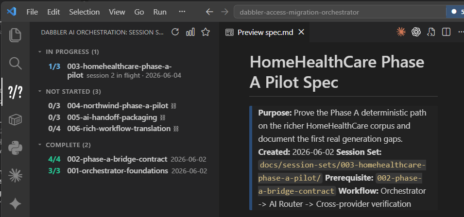

# Dabbler AI Orchestration

An AI-led coding-session workflow for VS Code. Structured AI sessions
with mandatory cross-provider verification, automatic cost tracking, git-
worktree-aware session-set state, and a Work Explorer in the
activity bar.

---

## What this repo is for

The framework treats AI coding work as a sequence of **sessions** —
bounded slices that run to completion in one orchestrator
conversation, end with a verification + commit, and stop. A
**session set** is an ordered chain of sessions that delivers one
feature, refactor, or aspect of the solution. Each set lives at
`docs/session-sets/<slug>/` with a small predictable shape (`spec.md`,
`session-state.json`, `activity-log.json`, `change-log.md`).

Inside each session, the **orchestrator** (Claude Code, Codex,
GitHub Copilot, or Gemini Code Assist) does mechanics — file edits,
shell, git — and dispatches every reasoning task (code review,
security review, analysis, architecture, documentation, test
generation, end-of-session verification) through `ai_router.route()`.
The router picks the cheapest capable model per task type, escalates
on poor responses, and runs cross-provider verification by a
**different provider** to catch provider-specific blind spots.

Every routed call is appended to `ai_router/router-metrics.jsonl`, so
per-set, per-task, and per-model spend is fully auditable. The
Work Explorer extension view is the at-a-glance companion: it reads
the same files the router writes and renders three groups in the
activity bar (**In Progress**, **Not Started**, **Done**), with
worktree auto-discovery so parallel sessions surface across sibling
workspaces. Full execution mechanics live at
[docs/ai-led-session-workflow.md](docs/ai-led-session-workflow.md);
deeper feature descriptions live at
[docs/repository-reference.md](docs/repository-reference.md).

---

## Highlights

- **Session sets and sessions** — Work is organized into bounded
  sessions inside ordered session sets, each with its own folder of
  artifacts the extension reads to render the activity-bar inventory.
  [Deep dive](docs/repository-reference.md#1-work-is-organized-into-session-sets-and-sessions).
- **Cost-minded orchestration** — The router routes each task to the
  cheapest capable tier, escalates on poor responses, and uses a
  per-task-type effort overrides. Real metrics from contrasting
  projects show **73% savings vs Opus-only** on a CLI/library project
  (990 calls) and **32% savings** on a full-stack UI app with UAT/E2E
  gates (370 calls) — see
  [docs/sample-reports/](docs/sample-reports/) for the full reports.
  [Deep dive](docs/repository-reference.md#2-cost-minded-orchestration).
- **Cross-provider verification** — Every Full-tier session ends with
  `verify_session`, which sends the work to an independent
  model from a different provider (mandatory — the close gate refuses an
  unverified close). The verifier returns structured JSON
  (`{"verdict": "VERIFIED" | "ISSUES_FOUND", "issues": [...]}`); the
  orchestrator surfaces disagreements for human adjudication rather
  than self-resolving.
  [Deep dive](docs/repository-reference.md#3-cross-provider-verification).
- **Git integration + parallel session sets** — Every session ends
  with `git add -A && git commit && git push`. Multiple session sets
  can run in parallel via isolated git worktrees on
  `session-set/<slug>` branches, with the last session merging back
  into main cleanly.
  [Deep dive](docs/repository-reference.md#4-git-integration-and-parallel-session-sets).
- **Robust fallbacks** — Tier escalation on empty/truncated/refused
  responses; two-attempt verifier fallback when a provider's HTTPS
  layer fails; documented escalation ladder if both verifier
  attempts fail. The work is preserved in git for human review
  either way.
  [Deep dive](docs/repository-reference.md#5-batching-and-robust-fallbacks).
- **UAT + E2E support (tri-state, opt-in).** Specs declare
  `requiresUAT` and `requiresE2E` as `true | false | "suggested"`.
  `true` enforces a UAT checklist + matching Playwright coverage as
  a close-out gate; `false` skips both surfaces; `"suggested"` asks
  you at session start whether you want E2E tests, UAT checklist,
  both, or neither, records your choice, and gates close-out
  accordingly. No-UI repos default to the universal core (build,
  test, verify, commit) with no UAT/E2E surface area.
  [Deep dive](docs/repository-reference.md#uat-and-e2e-support-when-to-opt-in).
- **Full and Lightweight tiers.** Specs declare `tier: full` (default)
  or `tier: lightweight`. The tier changes **one thing only** — whether
  the AI router makes metered API calls. **Lightweight is router-off,
  not Python-off:** both tiers use a `.venv` + `dabbler-ai-router`, the
  same `session-state.json` lifecycle, the same close-out gate, and the
  same Work Explorer. Full adds cost-minded routing and the
  mandatory Step 6 cross-provider verification command on every session;
  Lightweight makes zero metered calls and
  verifies per-set (copyable review prompts pasted into a different
  assistant, a dedicated different-engine verification session, or opt
  out). On either tier, `start_session` prints a loud, non-blocking
  banner the moment a set's verification or remediation is owed, so
  nothing sits forgotten between sessions. The single source of truth is
  [docs/concepts/tier-model.md](docs/concepts/tier-model.md).
  [Deep dive](docs/concepts/tier-model.md).

---

## Quick start

1. **Install the extension** from the VS Code Marketplace:
   - VS Code → **Extensions** view (`Ctrl+Shift+X`) → search
     `Dabbler AI Orchestration` → **Install**.
   - Or from a terminal: `code --install-extension DarndestDabbler.dabbler-ai-orchestration`.
   - Or directly from the
     [Marketplace listing](https://marketplace.visualstudio.com/items?itemName=DarndestDabbler.dabbler-ai-orchestration).
   - Offline / firewall fallback: each tagged release attaches the
     `.vsix` as a downloadable asset on the
     [GitHub Releases page](https://github.com/darndestdabbler/dabbler-ai-orchestration/releases);
     pick the latest, then **Extensions → ... → Install from VSIX...**.
2. **Open your workspace.** Any folder with — or destined for — a
   `docs/session-sets/` directory. The activity-bar **Session Set
   Explorer** icon appears automatically once that path is present.
3. **Run `Dabbler: Install ai-router`** from the command palette
   (`Ctrl+Shift+P`). The command auto-detects (or offers to create)
   a workspace `.venv/`, runs `pip install dabbler-ai-router` inside
   it, and materializes `ai_router/router-config.yaml` for tuning.

Then **set API keys** as environment variables (one-time):
`DABBLER_ANTHROPIC_API_KEY`, `DABBLER_GEMINI_API_KEY`,
`DABBLER_OPENAI_API_KEY` — the
[Prerequisites](#prerequisites-tools-and-accounts) section below has
the sign-up links and notes which providers are required.

Subsequent updates: **`Dabbler: Update ai-router`** from the command
palette.

> **CLI fallback** — `python -m venv .venv && .venv/Scripts/pip install dabbler-ai-router`,
> then `from ai_router import route` from your orchestrator script.

---

## For new projects: the Getting Started form

If you're starting a new project — greenfield, or an existing local
project that hasn't yet adopted the workflow — the recommended
starting point is **`Dabbler: Get Started`** from the command palette.
The Work Explorer's Getting Started form walks you through tier
choice (Full vs. Lightweight — see
[docs/concepts/tier-model.md](docs/concepts/tier-model.md)); picking
Full surfaces a second choice for provider access — direct `DABBLER_*`
API keys (the default) or a GitHub Copilot CLI seat that routes calls
through your Copilot subscription with no provider keys; picking
Lightweight surfaces a second choice between separate verification
sessions (a dedicated session on a different AI engine or provider
reviews the work before the set can close) and manual review (paste a
review prompt into a second AI assistant yourself and record what it
says — the default). All picks persist through a window
reload. Environment faults surface in a persistent **System Status
strip** above the form (and above the Work Explorer tree), visible
only when a fault exists: a missing Python interpreter, a missing
provider API key on the direct-API option, or a missing `copilot`
CLI with the Copilot seat option selected. The form also runs the
Full-tier verification **budget / NTE step** (saved to
`ai_router/budget.yaml` —
[schema](docs/budget-yaml-schema.md); prerequisites are checked before
any write, so a missing one fails with a friendly explainer and
leaves nothing behind) — and performs a one-click project scaffold: the
`.venv` with the router package, the AI-agent instruction files, and
the `docs/session-sets/` home. With the Copilot seat option, Build
also runs the seat's catalog check and enables the seat profile only
when the seat confirms two distinct provider families — validated so
far only on a single personal seat (the same seat Set 078's evidence
came from); multi-seat and enterprise-seat model availability are not
yet validated, and an enterprise-managed seat may expose only one
provider family and fail the two-provider check even when the guided
flow itself succeeds — the form reports that honestly instead of
leaving a silently broken router. (Running the Copilot seat also needs a
one-time per-machine setup — install the `copilot` CLI, log in to your
tenant, run the auth-preflight — walked through in
[docs/copilot-seat-setup-checklist.md](docs/copilot-seat-setup-checklist.md);
an unauthenticated seat is blocked at session start rather than silently
faking verification.) The form's optional second section, **Define
modules**, creates `docs/modules.yaml` on demand (explicit action only)
so the Work Explorer can group session sets by module — with a copyable
AI prompt that fills it in. Drafting `docs/planning/project-plan.md` and
decomposing it into session sets now happen from the **per-module row
actions** in the tree (and the Command Palette), one click from the
module they belong to. The four-tier budget mapping is documented in
[docs/ai-led-session-workflow.md → Cost-budgeted verification modes](docs/ai-led-session-workflow.md#cost-budgeted-verification-modes).

New to the team/module workflow? The hands-on tutorial
[docs/tutorials/module-team-hello-world.md](docs/tutorials/module-team-hello-world.md)
walks a three-person team through the whole flow end to end — scaffold,
modules, per-module plans and session sets, worktrees, CODEOWNERS +
monorepo CI, small PRs, tags and hotfixes — and pairs with a reusable
[module workflow review prompt](docs/tutorials/module-team-hello-world-review-prompt.md)
that coaches a team on how well they are practicing it.

Setting up without VS Code? See the manual-setup note in
[docs/quick-start.md](docs/quick-start.md). (The former conversational
"adoption bootstrap" path was retired in extension 0.32.0 once the
form gained its budget step;
[docs/adoption-bootstrap.md](docs/adoption-bootstrap.md) remains as a
redirect stub for older clients.)

---

## Prerequisites: tools and accounts

You need **VS Code**, at least one **orchestrator agent** installed as
a VS Code extension, and **API-key accounts** for all three model
providers (the router calls all three so cross-provider verification
has somewhere to route to).

### VS Code

- **Download:** [code.visualstudio.com](https://code.visualstudio.com/)
- **Getting-started docs:**
  [code.visualstudio.com/docs](https://code.visualstudio.com/docs) —
  the Extensions view (`Ctrl+Shift+X`) is what you'll use to install
  the Work Explorer in the [Quick start](#quick-start) above.

### Orchestrator agents (install at least one)

Pick whichever AI agent you want to drive sessions; the framework is
provider-agnostic and you can switch mid-set.

- **Claude Code (Anthropic)** — reads [CLAUDE.md](CLAUDE.md). Install
  via [claude.com/product/claude-code](https://www.claude.com/product/claude-code);
  docs at [docs.claude.com/en/docs/claude-code/overview](https://docs.claude.com/en/docs/claude-code/overview).
- **Codex (OpenAI)** — reads [AGENTS.md](AGENTS.md). See
  [openai.com/codex](https://openai.com/codex/) and the open-source
  CLI repo at [github.com/openai/codex](https://github.com/openai/codex).
- **GitHub Copilot** — reads [AGENTS.md](AGENTS.md). See
  [github.com/features/copilot](https://github.com/features/copilot);
  Marketplace listing at [GitHub.copilot](https://marketplace.visualstudio.com/items?itemName=GitHub.copilot).
- **Gemini Code Assist (Google)** — reads [GEMINI.md](GEMINI.md). See
  [codeassist.google](https://codeassist.google/) (free tier
  available); docs at [cloud.google.com/gemini/docs/codeassist/overview](https://cloud.google.com/gemini/docs/codeassist/overview).

### API keys (all three required)

The router calls all three providers and cross-provider verification
needs at least two providers live to be meaningful. Expect to set up
all three.

- `DABBLER_ANTHROPIC_API_KEY` — [console.anthropic.com](https://console.anthropic.com/)
  (Settings → API Keys, requires billing).
- `DABBLER_GEMINI_API_KEY` — [aistudio.google.com](https://aistudio.google.com/)
  (Get API key in the left rail; free tier is generous).
- `DABBLER_OPENAI_API_KEY` — [platform.openai.com](https://platform.openai.com/)
  (create a project, add a payment method, mint a key).

Set each provider-issued key as a Windows User environment variable;
macOS / Linux users can export them in their shell profile. Dabbler does not
issue separate API keys: use the same keys you get from Anthropic, Google, and
OpenAI, just under the `DABBLER_` environment variable names so the router does
not collide with provider-owned tools that auto-detect generic API-key names.
Optionally,
[pushover.net](https://pushover.net/)'s `PUSHOVER_API_KEY` and
`PUSHOVER_USER_KEY` enable end-of-session phone notifications — if
unset, the orchestrator skips the notify and prints to console as
usual.

---

## More

For technical reference (deep feature descriptions, the UAT/E2E flag
matrix, a worked end-of-session output example, and the repository
file map), see
[docs/repository-reference.md](docs/repository-reference.md).

For runtime mechanics (trigger phrases, the 10-step procedure, the
authoritative rule list every orchestrator obeys), see
[docs/ai-led-session-workflow.md](docs/ai-led-session-workflow.md).

For sample manager-report output from real projects at scale, see
[docs/sample-reports/](docs/sample-reports/).

For worked examples of cross-provider AI consultation in practice — what
each provider explored, where they agreed and meaningfully differed,
and what makes the pattern worth using — see
[docs/case-studies/](docs/case-studies/).

---

## License

This repo is released under the **MIT License**. See [LICENSE](LICENSE)
for the full text. Copyright © 2026 darndestdabbler.

> A duplicate `LICENSE` lives at
> [tools/dabbler-ai-orchestration/LICENSE](tools/dabbler-ai-orchestration/LICENSE)
> alongside the extension's `package.json`. The duplication is required:
> `vsce package` expects the file beside the manifest and has no flag
> to point elsewhere. Both files must be kept in sync.
