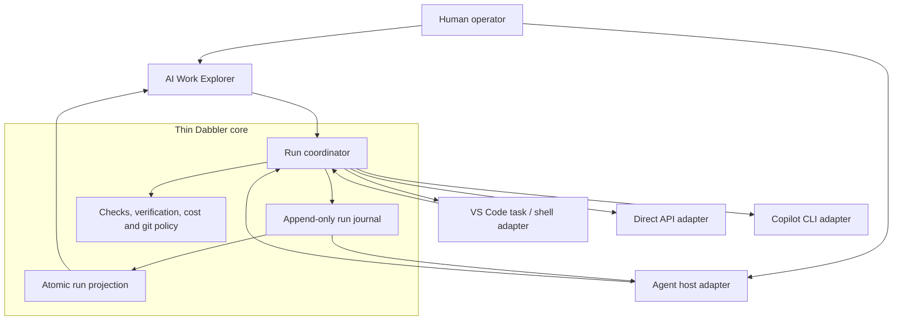
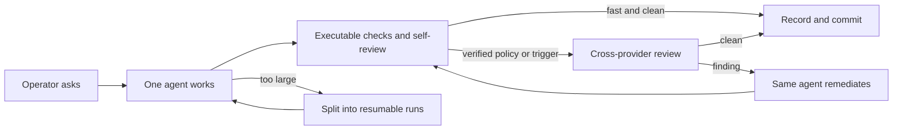
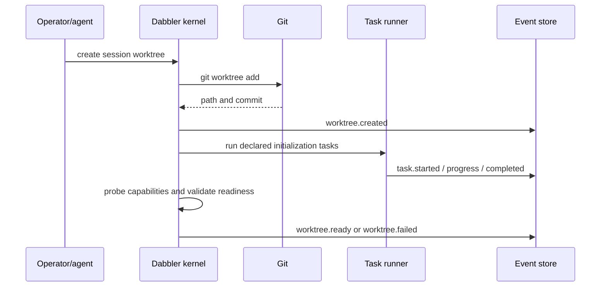

# An Agent-Native Architecture for Dabbler

**Date:** 2026-08-22  
**Status:** Revised architecture feedback, not an implementation plan

## Executive judgment

Dabbler is not architected all wrong. Its strongest decisions are the ones an
agent-native design still needs:

- Python decides policy while TypeScript renders it.
- Machine records are schema-validated and append-only.
- Tests, deterministic checks, provider exclusion, verdicts, and close gates do
  not depend on an agent remembering instructions.
- Model access already sits behind a transport boundary.
- The subject repository is increasingly language-neutral.

The main architectural limitations are simpler than I first stated:

1. Dabbler charges a project-scale lifecycle to work that may only need one
  capable agent, executable checks, and a commit.
2. The records it does need are fragmented, so the AI Work Explorer infers
  current state instead of reading one durable run journal.

The benchmark is not another orchestration framework. It is a strong agent that
finishes a bounded task correctly in a few minutes with little ceremony. The
HL7 result described by the operator makes that concrete: Opus 5 reached about
99% in minutes for under $3, while the current Dabbler decomposition could turn
the same task into a day of session machinery. Any replacement that cannot stay
close to the former on straightforward work has failed, even if its records are
beautiful.

The recommended architecture is therefore a hybrid, not an agents-SDK
architecture:

> Keep a small, deterministic Dabbler run journal and verification dispatcher.
> Treat agents, subagents, skills, hooks, VS Code tasks, Copilot CLI, and direct
> APIs as replaceable execution adapters. Add decomposition and stronger review
> only when the task or operator asks for them.

After comparing Fable's paper and the operator's experience that rebuilding v2
took hours while enhancing v3 takes days, I would now separate the architecture
decision from the implementation-preservation decision:

> Preserve Dabbler's invariants and external contracts, but do not presume that
> the current Python interior should survive. A bounded, workflow-first rebuild
> of the lifecycle kernel is more credible than continuing to accrete behavior
> into the current owners.

This would improve visibility without making session integrity depend on one
agent host, carrying every organically grown internal seam forward, or making
staff learn a second project-management system before they can ask an agent to
fix something.

## The minimum product

Dabbler should expose one pipeline with three policies, not three frameworks:

| Policy | Default use | Added ceremony |
| --- | --- | --- |
| `fast` | Bounded, executable, low-consequence work | One agent implements, runs checks, self-reviews, and records the result |
| `verified` | Meaningful production changes or explicit operator choice | Adds one cross-provider review and automatic remediation; another round only after a finding |
| `program` | Work too large for one context or one reviewable diff | Adds decomposition into resumable runs with dependencies |

The common path should feel like **Run with Dabbler**, not like opening a
session set. Internally and in the Explorer, every run may still use a standard
session lifecycle: `working`, `checking`, optional `verifying`, optional
`remediating`, then `completed`, `failed`, or `cancelled`. Starting the session
may be implicit. A plan is just the agent's normal plan unless size or risk
requires a durable one. Session sets remain available for programs, but
disappear from the basic workflow.

Escalation must be conditional and legible. Initial triggers should be a short
configured list, not a learned risk subsystem: operator request, sensitive
paths, no meaningful executable check, failed or flaky checks, agent-reported
uncertainty, a diff over the review-size limit, or exhaustion of the time/cost
budget. A repository may choose `verified` as its default. Dabbler should not
silently convert a five-minute task into a program.

## Adjustment after reading Fable

Fable's paper sharpens the proposal in useful ways. We agree that the router
must own truth, an event stream is the highest-value Explorer improvement,
skills fit ecosystem knowledge, hooks are optional enforcement accelerators,
and same-provider subagents cannot satisfy cross-provider verification.

Fable's postscript correctly identifies an overreach in my first draft: a
generic task CRUD API and five-role taxonomy would add a second ontology beside
sessions, steps, rounds, and evidence. I withdraw those parts. The replacement
should expose only four durable concepts:

- **run**: one reviewable unit of work, often one agent conversation;
- **check**: executable evidence produced during the run;
- **verification attempt**: an optional external review and remediation round;
- **event**: an append-only fact used to recover and project those records.

Planner, investigator, and implementer are prompt shapes, not protocol roles.
The only authority distinction the core needs is working agent versus external
verifier.

One disagreement remains:

| Question | Fable | Revised judgment |
| --- | --- | --- |
| Preserve the router implementation? | Keep `ai_router` unchanged in authority and largely in shape | Preserve its authority and contracts, not necessarily its implementation |

The current concentration is a warning. `verify.py` is 2,367 lines while the
active envelope says it must finish below 1,200, and lifecycle behavior is
spread across session, verification, evidence, ledger, progress, affected-test,
and extension refresh paths. The v3 plan deliberately added behavior to those
owners while retaining the old path as fallback. That was rational for a
low-risk migration, but it also creates the characteristic failure mode the
operator reports: each enhancement must preserve and coordinate many implicit
contracts, so local changes become system changes.

This does not imply a big-bang rewrite of everything. It argues for a small
replacement core whose behavior is driven by one workflow definition and one
event protocol, proved against existing fixtures before a single cutover. A
long-lived dual-write or compatibility layer would defeat the purpose.

## What exists today

The current architecture already has useful boundaries:

| Concern | Current owner | Architectural value |
| --- | --- | --- |
| Session start/close and locking | `ai_router/session.py` | Deterministic lifecycle boundary |
| Machine-owned state writes | `ai_router/writers.py` | Single mutation authority |
| Work Explorer projection | `ai_router/progress.py` | Python-owned read model |
| Step and verification history | `ai_router/ledger.py` | Validated append-only evidence |
| Verification orchestration | `ai_router/verify.py` | Policy and round control |
| Provider routing | `ai_router/route.py`, `identity.py`, `selection.py` | Cross-provider policy |
| Model transport | `ai_router/transports/` | Copilot CLI/direct API seam |
| Extension rendering | `tools/dabbler-ai-orchestration/src/` | Thin UI over Python projection |

The extension watches lifecycle Markdown/JSON files, invalidates an mtime cache,
and runs `python -m ai_router.progress --json` for changed sets. It also polls
every 30 seconds as a recovery path. This is a sound projection pattern for
coarse session state, but it cannot faithfully display a running check, a
pending operator decision, a provider dispatch, or remediation because those
are not part of one projected run.

The current `step-execution.jsonl`, `rounds.jsonl`, test evidence, disputes, and
metrics are already event-like. The opportunity is to standardize their common
envelope and projection, not replace their domain-specific payloads with a
generic agent transcript.

## Preserve the familiar documents

Keep the four familiar files if they remain projections rather than four
authorities:

| File | Recommended role |
| --- | --- |
| `spec.md` | Human-readable intent and task list; authored for program work, generated as a short summary for ordinary sessions |
| `session-state.json` | Atomic current-session projection, including revision, state, active task, timestamps, cost, and verification summary |
| `activity-log.json` | Human/tool-readable task history projected from the run journal |
| `change-log.md` | Generated completion summary with changes, checks, verification, cost, and commits |

The hidden append-only run journal remains the recovery source. A single Python
projector writes each compatibility view by atomic replace, stamps JSON views
with the same journal revision, and can regenerate all four. The extension
accepts a coherent revision or refreshes; it never combines contradictory
meanings from their mtimes. This is not a long-lived dual-write migration: the
journal is canonical and the named documents are views. If preserving an exact
legacy field forces old lifecycle logic back into the core, preserve the
filename and useful human content, not the accidental field shape.

This compromise has real adoption value. Existing repositories, staff habits,
and Explorer commands keep recognizable artifacts, while the rebuild is free
to remove the old implementation behind them.

## Proposed architecture



The common workflow should be visibly short:



### 1. Thin run core

The core owns run identity, append-only facts, verification eligibility, cost
accounting, and final git/evidence checks. It does not own planning style,
agent personas, shell execution, or language semantics. Its public surface can
remain a handful of structured commands:

```text
dabbler run
dabbler verify
dabbler status --json
dabbler resume
dabbler finish
```

`run` may wrap an existing agent conversation or register one created by the
host. `verify` dispatches provider-neutral review and loops findings back to the
working agent. `finish` records the final checks, cost, commit, and outcome.
The extension and skills call these commands; they do not reimplement them.

### 2. Minimal durable record

Do not convert every shell process or plan step into a first-class task. Append
events only when they are useful after a crash or to a human observer: run
started, summary/checkpoint, check completed, verification dispatched, finding
received, remediation started, waiting for operator, cost updated, and run
finished. Existing specialized records can retain their payload schemas under
one common envelope.

Every event should carry a small common envelope:

```json
{
  "schema_version": 1,
  "sequence": 1842,
  "event_id": "...",
  "event_type": "run.waiting_operator",
  "occurred_at": "...",
  "repository_id": "...",
  "worktree_id": "...",
  "run_id": "...",
  "attempt": 2,
  "actor": {"kind": "agent", "id": "...", "provider": "..."},
  "summary": "Approval required before widening the file envelope",
  "artifact_refs": ["..."],
  "payload": {}
}
```

The event sequence is repository-local and monotonic. Domain payloads retain
their own schemas. Sensitive prompts, secrets, raw chain-of-thought, and large
tool output do not belong in the envelope; they are either excluded or stored
as access-controlled artifacts referenced by digest.

The core folds events into an atomic `run-projection.json` with a projection
revision and last consumed sequence. The journal is the recovery source; the
projection is the cheap UI read model. A run needs only a few projected states:
`running`, `waiting`, `verifying`, `remediating`, `completed`, `failed`, and
`cancelled`.

### 3. Agents, delegation, and subagents

Default to one capable editing agent. It already has repository context, can
iterate quickly, and can verify straightforward work against executable tests.
Spawning planner, implementer, and investigator agents by default repeats
context and creates handoff loss.

A high-tier planner delegating to a lower-tier worker is an optimization to
measure, not an architectural assumption. Delegate only when:

$$
C_{plan}^{high} + C_{work}^{low} + C_{verify} + E[C_{rework}]
< C_{work}^{high}
$$

and the added latency remains inside the run budget. The operator's study says
the left side is often slightly *higher* for one-off work. Delegation is most
plausible for repeated, mechanically checkable tasks where one expensive plan
can drive several cheap workers, or where the high-tier model's scarce usage is
more important than dollar cost. If verification is subjective or rework is
likely, let the capable agent implement directly.

Subagents remain useful for bounded read-only research or parallel independent
worktrees. They are optional host capabilities, not durable protocol roles.

### 4. Skills

Skills are a good packaging mechanism for reusable operating knowledge, but the
initial product should ship very few:

- run or resume work with Dabbler;
- invoke cross-provider verification and remediation;
- work with a .NET solution, Maven project, or Gradle build;

Skills should call stable Dabbler commands and scripts. They should not encode
the state machine in prose. This makes them portable across skills-compatible
hosts and cheap to load progressively. A forked skill can isolate a large
investigation, but that capability is experimental and should be an
optimization rather than a requirement.

The extension can contribute default skills, while a repository can override
or add solution-specific skills. The kernel must continue to work with no
skills installed.

### 5. Hooks

Agent hooks are optional conveniences for telemetry and early feedback:

- `SessionStart`: correlate an agent session with a Dabbler session/worktree;
- `PreToolUse`: refuse a clearly disallowed file edit or command;
- `PostToolUse`: capture check metadata when reliable;
- `Stop`: record a summary and leave resumable state.

They should not be the only enforcement path. VS Code agent hooks and
agent-scoped hooks are currently preview features, host tool names differ, and
another harness may not run them. A pre-tool hook can provide a fast refusal,
but commit hooks, file-envelope comparison, evidence validation, and close
gates remain authoritative.

Never parse the transcript as a stable protocol. Current VS Code documentation
explicitly says its transcript format is not a stable hook API.

## Worktree-created shell tasks

The best owner of worktree initialization is a Dabbler worktree command, not an
agent and not `runOn: folderOpen` alone:



Initialization tasks should be declarative, idempotent, and independently
retryable. Examples include creating a Python environment, package restore,
toolchain version checks, generated-source setup, and a cheap compile probe.
Each task records command identity, exit status, duration, and relevant artifact
digests. Secrets stay in the process environment and are never copied into an
event.

The VS Code extension can expose these through a `TaskProvider` using
`ProcessExecution` where possible. `ProcessExecution` avoids shell quoting
differences; `ShellExecution` is reserved for commands that genuinely require
shell syntax. VS Code task start/end events improve terminal visibility and
cancellation, while Dabbler events retain the domain meaning.

Automatic `folderOpen` tasks are an optional recovery path for a worktree made
outside Dabbler. They require workspace trust and user permission, so the
extension should detect `created but not initialized`, explain the state, and
offer **Initialize Worktree** rather than silently assuming the task ran.

## AI Work Explorer reliability

The Explorer should become a projection client rather than a set-directory
scanner that knows which source files imply change.

Recommended update flow:

1. Watch the atomic run projection and machine event files.
2. On change, request `progress --json --after <last-sequence>` or read the
   projection through one long-lived CLI process.
3. Apply only a contiguous sequence of validated events.
4. If a sequence is missing, a schema is unknown, or a process reconnects,
   discard the incremental cache and fetch a full projection.
5. Keep a slow poll only as reconciliation, not as the normal update path.

This gives the tree explicit rows for active, waiting, verifying, remediating,
completed, and failed runs. It can show duration, verification rounds,
provider, cost status, and the latest public rationale without deriving policy
in TypeScript.

Keep the task list. For a short `fast` session it may contain one row such as
"Implement and check" plus discovered checks. For longer or decomposed work it
shows the agent's current plan, but task rows remain presentation records rather
than independent lifecycle authorities. Each row should carry `startedAt`,
`lastActivityAt`, state, and an optional short progress summary.

Twenty minutes is the operational threshold, not a decomposition trigger. A
session may remain one reviewable run after twenty minutes, but by then the
Explorer must make liveness unambiguous:

- tool completion, check output, agent checkpoint, and verification progress
  update `lastActivityAt` automatically;
- while a coordinator-owned process is alive, a cheap local heartbeat updates
  liveness without spending model tokens;
- the Explorer shows elapsed time and "active N minutes ago" for the current
  task;
- missing activity beyond a short configured threshold changes the display to
  **possibly stalled** and offers inspect, resume, or cancel; it does not infer
  failure or cancel automatically;
- a sequence gap or stale projection triggers a full projection refresh.

The heartbeat proves process liveness, not useful model thinking. Human-visible
progress still comes from concise checkpoints and observable tool/check events;
private chain-of-thought is neither required nor promised.

Do not rely only on an in-memory event bus. The extension host restarts, remote
workspaces disconnect, and worktrees can be changed by a CLI outside VS Code.
Durable events plus an atomic projection make live updates useful and recovery
boring.

## Cross-provider verification

Cross-provider verification becomes easier if it is expressed as a provider-
neutral job, not as a special agent conversation:

```text
VerificationRequest
  request_id
  policy_version
  orchestrator_identity
  excluded_providers
  evidence_manifest
  output_schema
  timeout_and_budget

VerificationResult
  request_id
  effective_provider
  requested_model / served_model
  transport
  verdict_payload
  usage_and_cost_status
  raw_output_digest
```

The existing `Transport.dispatch()` boundary is close to this already. Add job
lifecycle around it, retain Python-side provider identity and exclusion, and
implement adapters for:

- direct Anthropic/OpenAI/Google APIs;
- Copilot CLI;
- a VS Code/Copilot agent host when it exposes a suitable invocation surface;
- future local model or remote worker transports.

A custom verifier agent or skill can prepare and explain a request, but the
kernel selects an eligible provider, validates the structured result, and
writes the verdict. Copilot and direct API then differ in transport metadata
and accounting, not in verification semantics.

This also makes cancellation and retry clearer. A cancelled dispatch is an
immutable failed/cancelled attempt; escalation creates another attempt with a
new effective model. The round record references the successful attempt.

## Human visibility and intervention

This design can provide substantially better operational visibility, with one
important limit: it should not promise access to a model's private
chain-of-thought. Operators can reliably see:

- the current run and, for program work, its small dependency list;
- the working agent, model/provider, tools invoked, and files changed;
- concise agent-authored progress summaries and decision rationales;
- deterministic command output and normalized diagnostics;
- evidence requests, verification findings, retries, and cost status;
- why a run is waiting and what decision is required.

Useful controls are **Pause after current tool**, **Cancel attempt**, **Resume**,
**Send guidance**, **Approve/deny scope change**, and **Open evidence**. Guidance
becomes a timestamped operator event consumed at the next checkpoint. It should
not mutate an already-issued prompt invisibly.

Interruption is cooperative. Shell tasks can usually be terminated through the
VS Code task execution handle; model requests need cancellation tokens or
transport-specific cancellation. A hard kill may leave side effects, so a
resumed run probes its worktree and last recorded check before continuing.

## .NET and Java

This architecture improves platform support if Dabbler models **capabilities
and commands**, not language syntax.

A solution profile should declare:

- discovery markers such as `.sln`, `.slnx`, `.csproj`, `pom.xml`,
  `settings.gradle`, or `build.gradle`;
- restore, build, test, format, and analyzer commands;
- affected-test rules and smoke tests;
- machine-readable report formats such as TRX/JUnit and SARIF;
- VS Code problem matchers or diagnostic adapters;
- required toolchain probes and environment variables;
- whether commands are worktree-safe and cache-safe.

Example task families:

| Capability | .NET | Java |
| --- | --- | --- |
| Restore | `dotnet restore` | Maven/Gradle dependency resolution |
| Compile | `dotnet build --no-restore` | `mvn compile` / `gradle classes` |
| Test | `dotnet test` with TRX | Surefire/JUnit via Maven or Gradle |
| Static analysis | Roslyn analyzers/SARIF | Checkstyle, SpotBugs, Error Prone |
| Diagnostics | MSBuild problem matcher | Maven/Gradle/Javac problem matcher |

The extension can use VS Code Tasks, Problems, and Test APIs for native display,
but Dabbler must record the declared command and evidence itself. Installed C#
or Java extensions are optional presentation/enrichment adapters, not required
policy dependencies.

This is more robust than building a Python AST plug-in system for every
language. It is also consistent with the current move toward declared test
selection and language-neutral evidence.

## Adoption and apparent architecture

Using agents can make Dabbler feel standard only if Dabbler remains visibly
small. An assortment of custom agents, hooks, daemons, schemas, and lifecycle
verbs would have the opposite effect: staff would correctly perceive another
proprietary framework wearing Microsoft or Google terminology.

The adoption surface should therefore be:

- one extension using VS Code's standard Agent, Task, Test, Problems, and Git
  surfaces;
- at most one Dabbler working agent and one verification skill in the basic
  installation;
- two primary commands: **Run with Dabbler** and **Verify Current Changes**;
- ordinary provider agents underneath, selectable by team policy;
- a CLI-only path with the same run record for automation and non-VS Code use.

The value proposition is correspondingly narrow: Dabbler remembers the work,
runs the declared checks, can obtain an independent provider review, loops
findings back for remediation, records cost, and leaves Git in a known state.
Planning, coding, shell interaction, and language intelligence should look like
the host platform, because they *are* the host platform. This gives staff a
Microsoft- or Google-shaped daily workflow without pretending those vendors own
Dabbler's integrity rules.

## Fragility analysis

### What would make it more fragile

- Making a preview agent SDK or hooks the only way to start, stop, or validate
  work.
- Encoding policy in `.agent.md` or `SKILL.md` prose in addition to Python.
- Depending on host-specific tool names or transcript formats.
- Assuming a subagent completion signal means its work is correct or durable.
- Keeping live state only in the VS Code extension host.
- Requiring Copilot to be installed for CLI, CI, or direct-API operation.

### How to contain that risk

- Define the run/event schemas and command protocol independently of any SDK.
- Use capability negotiation and schema versions at adapter boundaries.
- Feature-detect agent, hook, task, and model APIs.
- Preserve a fully supported CLI-only path.
- Treat hooks as accelerators and telemetry, never as the evidence authority.
- Add contract tests per adapter using the same request/result corpus.
- Rebuild projections from the durable event log after crashes.
- Keep provider transports out of the lifecycle kernel.

Under those constraints, adopting agents can make the system **less** fragile:
host churn is isolated to adapters instead of leaking into session policy.

## Cost analysis

The relevant cost is not API spend alone. It includes model spend, operator
attention, elapsed delay, and expected rework:

$$
C_{total} = C_{models} + \lambda T_{operator} + \mu T_{elapsed}
  + E[C_{rework}]
$$

The weights $\lambda$ and $\mu$ differ by team, but neither is zero. A workflow
that saves $1 of tokens while adding an hour of ceremony is not economical.
Seat calls also remain *unpriced*, not free; local models consume compute and
operator time even when API cost is zero.

The direct-capable-agent baseline changes the routing conclusion:

| Work shape | Economical default |
| --- | --- |
| One-off, straightforward, executable checks | One capable agent implements and self-verifies |
| Repeated, uniform, mechanically checkable work | One capable planner may amortize instructions across cheaper workers |
| Difficult but objectively testable | Capable author; add external review only by policy or trigger |
| Difficult and weakly testable | Capable author plus capable independent verifier or human review |
| Large beyond one context/reviewable diff | Decompose into runs, then apply the same rules per run |

Cross-provider verification is valuable, but it is a quality purchase. In
`verified`, make that purchase automatically and visibly. In `fast`, make no
extra model call unless a configured trigger fires. Remediation calls happen
only when there is a finding. Every run carries a model-spend ceiling, elapsed-
time ceiling, and verification-round cap; reaching one pauses for the operator
instead of opening another autonomous layer.

The competitive acceptance tests should be explicit:

- `fast` adds no model call and no planning artifact beyond the working agent's
  normal behavior; framework overhead should be seconds, not minutes;
- `verified` adds at most one verifier call before a finding and should normally
  remain a minutes-scale workflow;
- a bounded HL7-class change must remain one run and should stay within the
  study's observed 20-minute envelope, not expand into session sets;
- the Explorer and cost journal update automatically without requiring the
  agent to narrate process bookkeeping;
- decomposition must demonstrate that the work exceeds one context or one
  reviewable diff; it is never ceremony for ceremony's sake.

Measure each policy against the same tasks run by an unwrapped capable agent.
Report correctness, model cost, operator minutes, elapsed time, and rework. Do
not ship a default whose reliability gain is smaller than its cost and latency
premium.

## Recommended rebuild path

Do not rewrite the framework *around an agent SDK*. Do consider replacing its
session interior with the thin run core. The economical strategy is a short
parallel prototype followed by one controlled cutover, not months of dual-path
enhancement.

### Phase 0: Bounded replacement spike

- Freeze the required invariants and CLI inputs/outputs as contract fixtures.
- Implement two vertical cases over the same run record: the unwrapped-agent-
  equivalent `fast` path and `verified` with one cross-provider review.
- Include the HL7-class benchmark or a task with equivalent boundedness and
  executable correctness.
- Derive Explorer state from the append-only run journal rather than writing it
  independently.
- Run the spike in a disposable branch or worktree. Do not wire it into the
  production path and do not maintain dual writes.
- Build the spike with ordinary agent sessions, Git, and direct tests. The new
  framework is not allowed to be its own prerequisite or gate.
- Set a hard time box and size target. A replacement that is not markedly
  smaller and easier to explain has falsified the rebuild thesis.

**Proof:** `fast` is close to the unwrapped agent in cost and elapsed time;
`verified` adds exactly one review before any finding; both survive process and
extension restarts and explain their current state from the journal. If this
cannot be built and explained quickly, stop: the design is still too large.

### Phase 1: Event projection and controlled cutover

- Have the Explorer render the new run projection using sequence-based
  refresh.
- Exercise missed events, malformed records, retries, cancellation, and
  outside-IDE CLI updates before cutover.
- Replace one complete lifecycle path at once. Keep compatibility at the CLI
  and artifact boundaries only; do not keep old and new state machines active.
- Preserve `spec.md`, `session-state.json`, `activity-log.json`, and
  `change-log.md` as generated views, and prove task start/liveness updates in
  the Explorer during a session longer than twenty minutes.
- Delete superseded orchestration and projection code in the same merge. The
  rebuild earns its existence by making the system smaller.

**Proof:** the Explorer survives extension restart, missed file events, an
outside-IDE CLI update, and a truncated/invalid event without displaying false
state; the old lifecycle implementation is no longer reachable.

### Phase 2: Standard host and verification adapters

- Add idempotent worktree initialization through VS Code Tasks.
- Ship one working agent and one verification skill; add hooks only where they
  remove a manual action.
- Formalize `VerificationRequest` and `VerificationResult` behind Copilot CLI
  and direct API adapters.
- Keep every operation available through the CLI and use the same run record.
- Validate one Python, one .NET, and one Java repository through declared
  commands rather than language-specific core code.

**Proof:** the same bounded change produces equivalent records across Copilot
in VS Code, CLI, and direct API verification; worktree setup is retryable; the
basic UI still exposes only Run, Verify, status, cost, and intervention.

### Phase 3: Optional program mode

- Add dependency-linked runs only after real work exceeds one context or
  reviewable diff.
- Add pause, cancel, resume, guidance, and approval controls only where the host
  cannot already supply them.
- Add planner-to-cheaper-worker delegation only after measured tasks satisfy
  the delegation inequality above.

**Proof:** program mode completes large work with lower total cost or better
reliability than sequential independent runs. Otherwise it remains out of the
product.

## Dogfooding policy

Do not build the new framework using the new framework from day one. That makes
an unfinished coordinator part of the critical path, confounds product defects
with implementation defects, and recreates v1's months-long feedback loop. The
three-hour v2 rebuild is the better baseline.

Dogfood in increasing levels of authority:

1. **External build:** implement the vertical slice with plain agent sessions,
  ordinary Git commits, direct tests, and a written compatibility contract.
2. **Shadow observation:** let the new journal and Explorer observe work on the
  new framework, but give them no blocking authority. Compare their records to
  what actually happened.
3. **Bounded use:** after the slice passes its benchmarks, use it for selected
  low-risk work with a one-command bypass. Any framework-caused delay consumes
  a small time budget and immediately falls back to the external workflow.
4. **Normal use:** only after restart recovery, long-session liveness,
  verification, cost, and Git records have passed acceptance should Dabbler
  govern work on itself.

Tests and Git remain outside the framework's trust boundary throughout. A
Dabbler failure must never prevent running its tests, inspecting its journal,
or committing a repair. Dogfooding is evidence collection, not a purity test.

## Decision and kill criteria

Proceed first with the bounded replacement spike. Defer a broad agent-SDK
integration until the workflow and event contracts exist. If the spike works,
prefer a decisive internal cutover over continuing to enhance both designs.

Continue only if the experiment demonstrates all of the following:

1. One lifecycle rule has one Python implementation.
2. The Explorer becomes more current without becoming a second policy engine.
3. CLI-only operation remains complete.
4. .NET and Java support requires command/report adapters, not core forks.
5. Cross-provider identity and verdict integrity remain kernel-enforced.
6. Agent-host changes are confined to adapters and skills.
7. `fast` remains competitive with an unwrapped capable agent; every stronger
  policy reports its incremental cost, latency, and quality.
8. The basic product can be explained as run, check, verify, record, and Git;
  program vocabulary is absent until needed.

Kill or narrow the approach if the agent host must own canonical state, if hook
transcripts become a required evidence source, if adapters duplicate lifecycle
rules, if the replacement cannot delete substantial old orchestration, or if
subagent decomposition raises cost without improving latency, quality, or
operator control.

## Bottom line

Agents, subagents, skills, and tasks can improve Dabbler, but they are not the
new architecture by themselves. The useful product is smaller: a run journal,
declared checks, optional cross-provider verification and remediation, cost/Git
recording, and a reliable projection. The operator's rebuild experience is
meaningful evidence that this core should be implemented from the fast workflow
backward, rather than excavated incrementally from the current command graph.

That design keeps what Dabbler already does unusually well, gives the AI Work
Explorer a reliable stream of meaningful state, standardizes verification jobs,
opens a clean path to .NET and Java, and lets operators pause or guide work at
explicit checkpoints. It also places the unstable parts of the ecosystem where
they belong: at the edges.

## Current platform references

The platform observations in this paper were checked against the official VS
Code documentation current on 2026-08-22:

- [Custom agents in VS Code](https://code.visualstudio.com/docs/copilot/customization/custom-agents)
- [Agent Skills in VS Code](https://code.visualstudio.com/docs/copilot/customization/agent-skills)
- [Agent hooks in VS Code](https://code.visualstudio.com/docs/copilot/customization/hooks)
- [VS Code task API](https://code.visualstudio.com/api/references/vscode-api#tasks)
- [VS Code tasks](https://code.visualstudio.com/docs/debugtest/tasks)