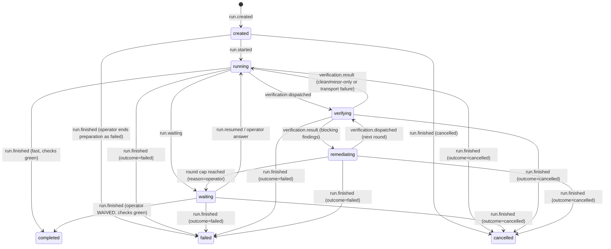
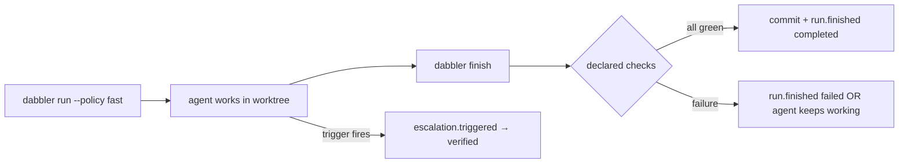

# The Thin Run Core — implementation blueprint

**Status:** Implementation-ready contract. Section 15 records settled choices
and the two operator-supplied inputs needed before benchmark/cutover. Authored
by Fable against the tree at set 145 session 1, then revised after a review of
its implementation contract. It derives from `agent-native-architecture-sol.md` and
`agent-native-architecture-fable.md`. This document is the input to a fresh
implementation session; that session edits code, this document does not.

Everything in this blueprint is normative unless marked *(informative)*.
Where this blueprint and the two memos disagree, this blueprint wins. Where
this blueprint is silent, the implementer follows the existing codebase's
conventions and does **not** invent a new contract — a gap found during
implementation is reported back as a blueprint defect, not filled ad hoc.

---

## 1. Product definition

One execution pipeline, two policies, and one lightweight organizational
hierarchy. A **session set** groups work around an objective. A **session** is
one ordered, bounded work unit inside that set. A **run** is one execution
attempt for a session, usually one agent conversation. The framework's job per
run: remember the work, run the declared checks, optionally obtain one
independent cross-provider review and loop findings back, record cost, and
leave git in a known state.

| Policy | When | What the framework adds |
| --- | --- | --- |
| `fast` | Bounded, executable, low-consequence work | Journal + checks + record + commit. **Zero framework model calls.** |
| `verified` | Meaningful production changes, or any trigger in §5.3 | One cross-provider review before any finding; remediation loop after findings; round cap. |

Both policies share one state machine (§4), one journal (§3), one projection
(§6), and one CLI (§7). Sets and sessions add navigation and durable intent,
not execution gates: no required set size, no required number of sessions, no
plan approval, and no set-level verification. A one-line fix can be one session
in the Default set; a long project can declare many sets and sessions in
advance. The hierarchy scales without charging project ceremony to every run.

## 2. Layout and naming

- **Control root:** resolve the main worktree from `git worktree list --porcelain`;
   its repository root owns `.dabbler/` and resolves `docs/session-sets/` for every linked
   worktree. All commands resolve this root before reading or writing, so linked
   worktrees do not create independent journals or counters. If Git cannot
   identify one main worktree, `run` refuses rather than guessing.
- **Package:** new modules live in the existing `ai_router` package.
  Distribution name, venv, and `python -m ai_router.<module>` invocation are
   unchanged. A `dabbler` console script is added as an alias to the canonical
   `ai_router.runcli` handlers (§7).
- **Machine records (append-only, router-written, never hand-edited):**
  - `.dabbler/journal.jsonl` — the run journal, one per repository (§3).
  - `.dabbler/run-projection.json` — atomic projection (§6.1).
   - `.dabbler/runs/<run-id>/heartbeat.json` — per-run liveness marker (§8.3).
  - `.dabbler/runs/<run-id>/` — per-run artifacts: verification attempts,
    check output digests, evidence bundles.
- **Human-facing documents (generated ignored local views, regenerable at any time):**
   - `docs/session-sets/<NNN-slug>/session-state.json`, `activity-log.json`, and
      `change-log.md` (§6.2).
- **Human-authored planning:** `docs/planning/project-plan.md` describes the
   project; each tracked `docs/session-sets/<NNN-slug>/spec.md` describes one
   objective and its ordered sessions (§6.4). Specs store intent, never runtime
   status or evidence.
- New v5 projects ignore the three generated filenames under
   `docs/session-sets/*/`; `spec.md` remains tracked. Existing tracked v4 files
   remain untouched historical artifacts despite matching those ignore rules.
- **Run id:** `r<NNNN>-<slug>`; `NNNN` is a zero-padded repository-local
   counter allocated under the journal lock as `max(existing NNNN) + 1` (the
   first event of a run fixes it); `slug` is kebab-case from the operator's ask,
   ≤ 40 chars. Run ids are never reused, including for cancelled runs.

## 3. The run journal

### 3.1 File contract

`.dabbler/journal.jsonl`. UTF-8, one JSON object per line, append-only,
fsynced per append. Appends are serialized through `.dabbler/journal.lock`
(same lock discipline as the current writers). Under that lock, a writer
validates the final line before allocating a sequence. If the final line is
truncated or invalid JSON, the writer truncates the file to the byte after the
last valid newline, fsyncs that repair, then appends. Readers ignore only an
invalid final line. If the final bytes are a complete valid object but lack the
terminating newline, the writer appends and fsyncs that newline before the next
record. Invalid JSON anywhere earlier is corruption and fails closed. No
rotation or compaction in this version (§14 non-goals).

### 3.2 Event envelope (schema_version 1)

```json
{
  "schema_version": 1,
  "sequence": 1842,
  "event_id": "uuid4",
  "event_type": "run.checkpoint",
  "occurred_at": "2026-08-22T09:14:02.113-04:00",
  "repository_id": "<sha256 of the repo root's first commit hash>",
  "worktree_id": "<absolute worktree path, forward slashes>",
  "run_id": "r0001-hl7-segment-parser",
  "attempt": 1,
  "actor": {"kind": "agent|operator|framework", "id": "...", "provider": "anthropic|openai|google|null"},
  "summary": "one line, ≤ 200 chars, human-readable",
  "artifact_refs": [".dabbler/runs/r0001-hl7-segment-parser/check-3.out.digest"],
  "payload": {}
}
```

Rules:

- `run_id` is required on every event except `organization.cancelled` and
   `organization.restored`, which are about a set or a session and may name
   no run at all; on those two it is `null`. The run fold skips them —
   cancelling a session is not a move in any run's state machine.
- `attempt` is the run's ordinal among the runs linked to the same session:
   the first run of a session is attempt 1, and a retry after a failed
   attempt is attempt 2. It is fixed when `run.created` is written and
   carried unchanged on every later event of that run.
- `sequence` is repository-local, strictly monotonic, and gap-free. A gap in
   the stored journal is corruption and fails closed; an Explorer that merely
   misses a watcher notification recovers from the intact file/projection
   (§8.1).
- `payload` schemas are owned per event type; unknown payload fields are
  preserved by readers, never trusted.
- Secrets, API keys, raw model prompts, chain-of-thought, and tool output
  over 4 KB never enter the journal. Large output is written under
  `.dabbler/runs/<run-id>/` and referenced by digest in `artifact_refs`.
- Timestamps are stamped by the writer at append time — never accepted from
  a caller (the decision-journal rule generalizes).

### 3.3 Event types (closed list, v1)

| `event_type` | Emitted by | Payload (required fields) |
| --- | --- | --- |
| `run.created` | `run`/`worktree create` | `policy`, `ask` (operator's request text), `base_commit`, `worktree_id`, `branch` (current branch for in-place runs; `dabbler/run/<run-id>` for prepared worktrees), `set_slug`, `session_number` |
| `run.started` | `run --register`/future host adapter | `mode`: `wrapped` \| `registered`, `engine`, `provider`, `model`, `identity_provenance` |
| `run.checkpoint` | agent via CLI/hook | `note` (≤ 500 chars), `ack_guidance_through` (sequence or `null`) |
| `run.waiting` | framework | `reason`: `operator` \| `dependency`, `question` (operator) or `depends_on_run` (dependency) |
| `run.resumed` | `resume` / `guidance --resume` | `probe`: result of §5.5 recovery probe, `answered_sequence` (`null` unless answering a wait) |
| `run.guidance` | operator via CLI/Explorer | `text` (≤ 2,000 chars), `answers_sequence` (`run.waiting` sequence or `null`) |
| `check.started` | `check`/`verify`/`finish` | `check_id`, `stage`: `targeted` \| `final-full`, `command`, `tree_digest`, selected tests and reasons |
| `check.completed` | `check`/`verify`/`finish` | `check_id`, `stage`, `command`, `exit_code` (nullable on timeout), `duration_seconds`, `outcome`: `passed` \| `failed`, `timed_out`, `tree_digest`, `post_tree_digest`, `tree_mutated`, selected tests and reasons, `report_ref` (`null` when none) |
| `verification.dispatched` | `verify` | full `VerificationRequest` (§9.1) minus `evidence_manifest` bodies |
| `verification.result` | `verify` | full `VerificationResult` (§9.2) |
| `remediation.started` | `verify` | `round`, `finding_count` |
| `run.cost_updated` | framework | `dispatch_id`, `cost_usd` (number or `null`), `pricing_status`: `priced` \| `unpriced`, token/credit usage when known, `source` |
| `run.finished` | `finish` / prepared-worktree removal | `outcome`: `completed` \| `failed` \| `cancelled`, `commit` and `tree_digest` (nullable before work/commit), `verdict` (`VERIFIED`/`ISSUES_FOUND`/`WAIVED`/`null`), `waiver_reason` (required only for `WAIVED`), `checks_green`: bool |
| `organization.cancelled` / `organization.restored` | operator via CLI/Explorer | `target`: `set` \| `session`, `set_slug`, `session_number` (required for session), `reason` |
| `worktree.created` / `worktree.ready` / `worktree.failed` | `worktree` | §11 |
| `escalation.triggered` | framework | `trigger` (one of §5.3), `from_policy`, `to_policy` |

Adding an event type is a `schema_version` bump plus an entry here. An
implementer needing an event type not on this list has found a blueprint
defect (§0 rule).

### 3.4 Schema files

The examples in this blueprint are backed by JSON Schema; they are not
duck-typed dictionaries. The slice adds:

- `schemas/run-event.schema.json`: envelope plus a closed `oneOf` payload for
   every §3.3 event type;
- `schemas/run-projection.schema.json`: §6.1, including derived task rows;
- `schemas/session-organization.schema.json`: normalized set/session intent
   parsed from §6.4 specs;
- `schemas/session-state-v5.schema.json`: the generated v5 set document
   (§6.2). v4's `session-state.schema.json` is frozen and still validates the
   historical files this projector never rewrites;
- `schemas/verification-request.schema.json`: §9.1;
- `schemas/verification-result.schema.json`: §9.2.

Writers validate before append/atomic replace. Readers validate before fold or
render. Unknown schema versions fail closed with the artifact path and version;
they are never coerced into the current shape. Schema files are package data.

## 4. Run states and permitted transitions

Eight states. `created` makes a crash between `run.created` and `run.started`
representable. `waiting` carries its reason in the event, not in the state
name. Terminal states are `completed`, `failed`, `cancelled`; nothing
transitions out of them — follow-up work is a new run. A terminal run may
receive only non-state `run.cost_updated` corrections for delayed accounting;
the fold updates cost and leaves state/outcome unchanged.



Transition authority: **only the framework moves the state**, by appending
the corresponding event through the CLI handlers. An agent proposes (calls
`finish`, `verify`); the handler validates preconditions (§5, §7) and either
appends or refuses with a named reason. A refusal is exit code 2 and a JSON
`{"refused": "<reason-token>", "detail": "..."}` on stdout.

State derivation is pure: `state(run) = fold(events for run_id)`. The
projection (§6) stores the folded value; the journal remains the authority.

## 5. Workflows, exactly

### 5.1 `fast`



1. In the in-place slice path, the agent's already-running session calls `run
   --register`; the handler appends `run.created` + `run.started` and records
   `base_commit` (current `HEAD`). For a prepared worktree, `worktree create`
   has already appended `run.created`; the agent starts in that worktree and
   calls `run --register --run <id>`, which validates the path and appends only
   `run.started`; registration refuses until `worktree.ready` exists. The run core does not launch a coding agent. `wrapped` remains a
   reserved event mode for a later VS Code/CLI host adapter; requesting it in
   the slice refuses `host-adapter-not-enabled`. Before appending, `run` refuses a
   worktree with tracked, staged, or untracked non-ignored changes, and refuses
   a detached `HEAD` or a second non-terminal run in the same worktree. This clean-start rule is the
   boundary that prevents `finish` from committing unrelated operator work.
   The current branch name is persisted in `run.created`.
2. The agent works. Checkpoints are optional but cheap
   (`checkpoint --run <id> --note "..."`); hooks may emit them automatically.
3. The shared check executor (invoked by `check`, `verify`, and `finish`)
   snapshots the candidate tree with the existing throwaway-index semantics of
   `evidence.snapshot_worktree_tree`: tracked and untracked non-ignored files,
   excluding `.dabbler/`. Tracked session-set specs remain part of the candidate
   tree like other project documentation. That Git tree id is the
   canonical `tree_digest`. `check --stage targeted` uses the declared
   `testing.selection` rules to run affected tests plus relevant cheap
   deterministic controls. Each command emits `check.started` before launch and
   `check.completed` afterward, including the selected tests and deterministic
   reason for each selection.
   If a command changes the candidate tree, `post_tree_digest` differs,
   `tree_mutated=true`, the check is not accepted as green, and the run returns
   to the agent. Ignored build/test output does not change the digest.

    Existing `testing.suites[].command` strings remain valid and execute through
    the platform shell because repository configuration is trusted input. New
    suites and controls should use `argv: [...]`, executed directly. `covers`
    entries are normalized repository-relative POSIX paths: an entry ending in
    `/` is a prefix; every other entry is an exact file. Globs are not accepted
   in `covers` v1. Optional `cwd` is a normalized repository-relative
   directory and defaults to the worktree root. Deterministic controls use this shape:

      ```json
      {
         "testing": {
            "controls": [
               {
                  "name": "extension-typecheck",
                  "kind": "typecheck",
                  "argv": ["npx", "tsc", "--noEmit"],
                  "cwd": "tools/dabbler-ai-orchestration",
                  "covers": ["tools/dabbler-ai-orchestration/"],
                  "required": true
               }
            ]
         }
      }
    ```

    `required: false` records a failure but does not block. A suite is always
    required. Duplicate names, an unknown control kind, both `command` and
   `argv`, or neither are configuration errors at load time. Optional positive
   `timeout_seconds` defaults to `run_policy.check_timeout_seconds`; timeout
   terminates the process tree, records `timed_out=true`, and fails the check.
   `testing.suites[].small` is optional and defaults false. The existing
   `testing.selection` block (`test_roots`, `test_glob`, `repo_wide`, `smoke`,
   and ordered `rules`) remains the one language-neutral targeted selector
   contract and moves behind `checks.py` rather than being reimplemented.
   If the candidate tree equals `base_commit`, `finish` refuses `no-changes`:
   it does not run checks, create an empty commit, or mark the run complete.
   The operator may cancel it or finish it honestly as failed.
4. For `fast`, `finish` runs each relevant complete suite once at `final-full`
   unless a fresh passing final-full record already exists for the current
   tree. This is the run's final proof, not a pre-verification run. All required
   checks green on one current `tree_digest` → `finish` stages
   all non-ignored changes, requires `git write-tree` to equal that digest,
   and commits (message: operator's ask, first line normalized and truncated to
   ≤ 72 chars, plus trailer `Dabbler-Run: <run-id>`). It then appends
   `run.finished`, regenerates the ignored local documents (§6.2), and prints
   completion JSON (§7). A crash after commit but before `run.finished` is
   recovered idempotently by finding the unique child commit with the run
   trailer and matching tree; it is never committed twice. Push is **not**
   performed unless `git.push_on_finish: true` in config (default false). When
   enabled, `finish` pushes the run branch to `git.remote` only after the commit;
   a push failure leaves the run nonterminal with the commit discoverable by
   recovery, so retrying `finish` retries push rather than commit.
5. Any check failed or mutated the candidate tree → `finish` refuses to
   complete; the agent may keep
   working and call `finish` again, or the operator may
   `finish --outcome failed` to record an honest failure. A failed run
   commits nothing.
6. **Framework model calls in `fast`: zero.** Framework overhead target:
   ≤ 10 seconds beyond the checks' own runtime (§12 acceptance).

### 5.2 `verified`

`fast` steps 1–2, then:

3. `verify` invokes `check --stage targeted` unless a fresh complete green
   targeted set already exists for the current `tree_digest`. It refuses
   dispatch on a failed, missing, or tree-mutating required targeted check.
4. `verify` builds the evidence bundle (diff `base_commit..tree_digest`, check
   results, the run's ask and checkpoints), constructs a
   `VerificationRequest` (§9.1), selects an eligible provider — **never the
   run's own provider**, using the existing `identity`/`selection`
   exclusion logic unchanged — and dispatches through the existing
   `Transport` seam (`api` or `copilot-cli`, same precedence rules as
   today). Response parsing is `verdict.parse_verification_response` and
   `classify_blocking`, **reused unchanged**.
5. Blocking findings → `remediation.started`; the same working agent fixes;
   the next `verify` reruns affected tests and invalidated controls against the new tree before
   dispatch — rounds ≥ 2 review the fix delta only. Minor-only
   findings **stop the loop** (severity-gated stop): the run may finish
   with the findings recorded.
6. Round cap (default 3, config `run_policy.verification_rounds`) →
   `run.waiting` with `reason=operator`. The operator's exits: more rounds
   (`resume --extend-rounds <N> --attest-operator`), `WAIVED`
   (`finish --waive "<reason>" --attest-operator`, recorded as such, exactly
   the current semantics), or `finish --outcome failed`. Extending by `N`
   raises both the run-local round limit and its logical `model_dispatches`
   ceiling by `N`; otherwise the default 3/3 limits would make round 4
   impossible. It does not raise the dollar or elapsed-time ceilings. If either
   is exhausted, the operator must also supply
   `--model-usd-budget <new-total>` and/or
   `--elapsed-minutes-budget <new-total>` on the same attested resume.
7. `finish` first requires that the latest accepted verification result is
   bound to the current `tree_digest`, then runs every relevant complete suite
   once at `final-full`. It reuses a fresh passing final-full record for the
   same tree and never treats targeted evidence as full-suite evidence. In
   addition to the final-full result, it requires latest
   `verification.result` verdict `VERIFIED`, or minor-only stop, or
   operator `WAIVED`. Verdict tokens come only from `verify` — the closed
   vocabulary and `validate_session_verdict` allowlist survive verbatim.

8. If `final-full` fails, the run returns to the working agent. Any fix changes
   the tree and invalidates the verification: run targeted checks, verify the
   changed tree, then run final-full again. A failed full run is never reused as
   proof and does not justify running the suite before the next verification.

### 5.2.1 No speculative full suites

Generated agent instructions and the run/verification skills state this
literally:

> Do not run a complete test suite before cross-provider verification. Ask
> Dabbler to run `check --stage targeted`, and run only the selected tests and
> cheap controls it reports. The complete suite runs once, after the final clean
> verification, through `finish`. After remediation, rerun affected tests,
> re-verify, then run the complete suite again only if the verified tree changed.

The framework enforces the evidence side even though it cannot stop an agent
from typing an expensive shell command. A pre-verification bare/full suite is
not accepted as targeted evidence and does not satisfy `verify`. Three explicit
exceptions exist:

1. the suite declares `small: true`, meaning the repository owner has decided
   its complete runtime is cheap enough for targeted-stage use;
2. the deterministic selector proves every test is affected by a repository-
   wide path such as the test runner or shared bootstrap;
3. the operator invokes targeted checking with
   `--allow-full "<reason>" --attest-operator`; the non-empty reason is journaled.

Unknown selection is not permission to run everything. It runs configured
smoke tests, records `selection-unknown`, and escalates `fast` to `verified` or
blocks verification until the operator resolves/overrides it. Selection reuses
the existing language-neutral `testing.selection` contract; no AST/import graph
is introduced.

Cost: a `dispatch_id` is `"<request_id>:<attempt>"` — the identity of one
transport attempt, derivable from the persisted `VerificationResult`, so a
seat measurement arriving later can address the dispatch it is correcting.
`verified` makes **at most one** framework model call before any
finding exists, plus one per remediation round. Every dispatch appends
`run.cost_updated` (`null` for seat calls — unpriced, not free). A later seat
measurement may append another update for the same `dispatch_id`; projection
uses the latest update per dispatch before summing, so append-only correction
does not double-count spend.

### 5.3 Escalation triggers (`fast` → `verified`)

A closed, configured list — no learned risk subsystem. The complete defaults
appear once below.

Triggers: operator request (`--policy verified` or mid-run
`escalate`), touched path matches `sensitive_paths`, no declared check
covers any changed path, a changed path no `testing.selection` rule maps,
the same check fails twice, agent-declared uncertainty
(`checkpoint --uncertain`), or diff exceeds `diff_limit_lines`.
Their event tokens, in that order, are `operator-request`, `sensitive-path`,
`no-declared-check`, `selection-unknown`, `repeated-check-failure`,
`agent-uncertain`, and `diff-limit`. `no-declared-check` and
`selection-unknown` are distinct declarations and neither implies the other:
a suite's `covers` can name a path that no selection rule maps, and the two
gaps are fixed in different places. Each token fires at most once per run; later observations remain
visible in check/checkpoint facts but do not duplicate the escalation event.
Each firing appends `escalation.triggered`. Budget ceilings are not escalation
triggers: reaching one in *either* policy appends `run.waiting` for the operator
and never opens another autonomous layer. `model_dispatches` counts logical
verification dispatches even when seat pricing is unavailable; transport-level
attempt/retry usage is recorded when observable and may not bypass the round or
elapsed-time ceilings.

The slice adds and validates these top-level configuration blocks; omitted
blocks receive the shown defaults. The example uses JSON object notation
deliberately: JSON is valid YAML, is accepted byte-for-byte in
`router-config.yaml`, and keeps this normative example machine-parseable.

```json
{
  "run_policy": {
    "default": "fast",
    "verification_rounds": 3,
    "diff_limit_lines": 1500,
   "check_timeout_seconds": 1800,
    "budgets": {"model_usd": 10.0, "model_dispatches": 3, "elapsed_minutes": 120},
    "sensitive_paths": []
  },
   "git": {"push_on_finish": false, "worktree_per_run": false, "remote": "origin"},
  "explorer": {"stale_after_minutes": 5},
  "worktree": {"root": null, "init": []}
}
```

`router-config.schema.json` is updated in the same change. Unknown keys and
invalid limits are refused at config load; `model_usd: null` disables only the
dollar ceiling, never `model_dispatches`. Existing repositories need no new
configuration for `fast`.

### 5.4 Large work remains the same execution model

Large work is organized by declaring more sessions and objective sets; each
session still executes through `fast` or `verified`. The slice has no separate
program policy, dependency scheduler, manager role, or different verification
pipeline. If teams later demonstrate a need for enforced dependencies, that is
a separate measured feature layered onto the same set/session organization.

No v3 plan/envelope machinery is carried forward merely by implication. If set
146 enables that machinery, its behavior remains a production compatibility
requirement under §10/§13 until explicitly replaced.

### 5.5 Interruption and resume

Interruption is cooperative; a hard kill is always survivable because the
journal is the authority. `resume` runs a recovery probe before the run
continues: worktree still exists, `HEAD` still equals `base_commit` (or the
run's own commits), last recorded check identified, no second live
heartbeat for the same run. Probe results ride on `run.resumed`. A probe
failure puts the run in `waiting(operator)` with the discrepancy named.

Recovery is state-specific and idempotent:

- `created` with a ready worktree remains visibly ready for registration;
   `resume` reports that condition but cannot invent agent identity. An
   idempotent `run --register --run <id> ...identity...` appends the missing
   `run.started`. Failed or incomplete initialization remains visible and
   retryable.
- A `check.started` without `check.completed` is an interrupted attempt. It is
   never treated as evidence; the next `check` starts a new attempt for that
   check id.
- `verifying` with a persisted request but no result probes the recorded
   transport process. If no live process can produce the result, recovery writes
   an immutable failed `VerificationResult` with `error_class=interrupted`; the
   next `verify` creates another attempt for the same round.
- A matching child commit carrying `Dabbler-Run: <run-id>` but no
   `run.finished` is the commit-before-journal crash window. `resume` validates
   its tree, appends `run.finished`, and never commits again.

## 6. Projections

### 6.1 `run-projection.json`

Written by atomic replace (temp file + rename) after **every** append, by the
same process while it still owns the journal lock. The command does not report
success until the journal event is durable and the projection/document writes
succeed. If projection fails after the durable append, the command returns
`projection-stale` with the committed sequence; it never rolls back the event or
pretends the view is current. `status` compares the journal tail and exact
session-set spec digest to the projection and rebuilds automatically on any
mismatch; `--rebuild` forces the same operation for troubleshooting. Shape:

```json
{
  "schema_version": 1,
  "projection_revision": 1842,
   "organization_digest": "sha256:...",
   "generated_at": "<occurred_at of projection_revision event>",
   "session_sets": [
      {
         "slug": "001-default",
         "title": "Default",
         "objective": "Initial and general project work",
         "state": "in-progress",
         "position": 1,
         "sessions": [
            {"number": 1, "title": "Plan the project", "policy": "fast", "state": "complete", "run_ids": ["r0001-plan-project"]},
            {"number": 2, "title": "Parse the HL7 message", "policy": "verified", "state": "in-progress", "run_ids": ["r0002-hl7-segment-parser"]},
            {"number": 3, "title": "Validate optional segments", "policy": "fast", "state": "not-started", "run_ids": []}
         ]
      }
   ],
  "runs": [
    {
      "run_id": "r0001-hl7-segment-parser",
      "policy": "verified",
      "state": "verifying",
      "waiting_reason": null,
      "ask": "...",
      "set_slug": "001-default",
      "session_number": 2,
      "engine": "claude-code",
      "provider": "anthropic",
      "branch": "dabbler/run/r0001-hl7-segment-parser",
      "started_at": "...",
      "last_activity_at": "...",
      "pending_guidance": 1,
      "attempt": 1,
         "tasks": [
            {"id": "work", "label": "Implementation", "state": "complete", "started_at": "...", "last_activity_at": "..."},
            {"id": "checks-1", "label": "Checks", "state": "complete", "started_at": "...", "last_activity_at": "..."},
            {"id": "verification-1", "label": "Verification round 1", "state": "in-progress", "started_at": "...", "last_activity_at": "..."}
         ],
      "checks": [{"check_id": "python", "outcome": "passed", "duration_seconds": 41.2}],
      "verification": {"rounds": 1, "last_verdict": null, "verifier_provider": "openai", "transport": "copilot-cli"},
      "cost": {"model_usd": 0.31, "unpriced_calls": 2},
      "commit": null,
      "outcome": null
    }
  ]
}
```

`projection_revision` **is** the last consumed journal sequence;
`organization_digest` is the SHA-256 of the ordered set slugs and exact
`spec.md` bytes.
`generated_at` is always copied from the latest journal event (or `null` at
revision 0); a spec-only rebuild changes the digest and organization projection without
inventing a clock value. Runs, checks, and object keys have specified stable
ordering, and serialization uses one canonical formatter. Any process can
rebuild the projection (`status --rebuild`); byte-identical output for the same
journal and spec bytes is a §12 acceptance criterion.

`tasks` is a display projection, not another authority or CRUD model. The
projector derives stable phase rows from events: `Implementation` starts at
`run.started`; each group of `check.started`/`check.completed` events is a
`Checks` attempt; each dispatch/result pair is a `Verification round N`; each
`remediation.started` opens a `Remediation round N`; and `run.finished` closes
the current phase. Every row carries `started_at`, `last_activity_at`, and
`state`. Task-row state is the closed display vocabulary `pending` |
`in-progress` | `waiting` | `complete` | `failed`; it never feeds run policy. A short `fast` run therefore has one or two useful rows, while a long
verified run visibly advances without requiring authored task bookkeeping.

### 6.2 The four preserved documents

Each `docs/session-sets/<NNN-slug>/` keeps the familiar four filenames.
`spec.md` is tracked authored intent and is never overwritten by projection.
For new v5 sets, the other three are ignored machine-written local views stamped
with the journal revision. They regenerate by atomic replace after relevant
events or spec changes and therefore cannot dirty or alter the candidate tree.
On another clone, `status`/extension activation regenerates them from tracked
specs plus the local journal. Existing tracked v4 files are historical inputs
and are never rewritten by the v5 projector.

| File | Projection rule |
| --- | --- |
| `spec.md` | Authored set title/objective plus ordered `### Session N: Title` sections. A session may state `Policy: fast` or `Policy: verified`; omitted policy uses repository default. Session number is stable after any run links to it. |
| `session-state.json` | Schema v5 set projection: set status, revision/digest, and ordered sessions with status, linked run ids, current run, start/completion timestamps, verification summary, and cost. It is wholly derived from spec + journal. |
| `activity-log.json` | Set-level display history and derived phase/task rows for each linked run attempt. It retains first start time and latest activity time. |
| `change-log.md` | Created after the first completed session and regenerated after later completion/accounting events: one concise block per session attempt with changes, checks, verification, cost, and commit. |

### 6.3 Organizational status and compatibility

Python parses every tracked set spec and joins it to journal runs. Session
status uses the familiar vocabulary:

- `not-started`: declared in spec, no linked run and no cancellation;
- `in-progress`: latest run is nonterminal, or latest attempt failed and awaits
  retry/operator disposition;
- `complete`: latest run completed;
- `cancelled`: explicitly cancelled with no later retry.

Set status is derived: `cancelled` after explicit set cancellation;
`not-started` when none of its sessions has activity; `complete` when every
non-cancelled declared session is complete; otherwise `in-progress`. Appending a
new session to a complete set reopens it to `in-progress`; this is organization,
not a protected lifecycle transition. A failed attempt keeps the session in
progress with an attention marker and can be retried as a new run linked to the
same session.

Existing v4 set files remain readable and render through the same hierarchy.
At cutover, active v4 sets must finish or be cancelled under v4; new sets use
schema v5 projections. Completed/cancelled v4 sets need no migration. An invalid `spec.md` produces a diagnostic but never
hides linked journal runs, which appear under an **Unorganized Work** row.

### 6.4 Minimal `spec.md`

The required authored shape is intentionally close to today's document:

```markdown
# Default

## Objective

Initial and general project work.

## Sessions

### Session 1: Plan the project

Create or import `docs/planning/project-plan.md` and identify the first bounded
implementation session.

### Session 2: Parse the HL7 message

Policy: verified

Implement and test the bounded parser path.
```

There is no mandated count, three-session template, step schema, envelope, or
approval section. Numbered/bulleted details beneath a session are visible notes,
not gates. Sessions are ordered by number; numbers are never reused after a run
links to them. New sets use the next repository-local numeric prefix and exist
only to group a distinct objective or direction of work.

## 7. CLI contract

The canonical invocation is `python -m ai_router.runcli <verb>`; the
`dabbler <verb>` console script calls the same parser and handlers. No per-verb shim
modules are created. All commands support `--json`. Exit codes: 0
success, 1 operational failure (named in JSON `error`), 2 refusal (named in
JSON `refused`). All output is a single JSON object on stdout when `--json`
is set; human text otherwise. Machine-relevant fields below are the
contract; extra informative fields may be added without a version bump,
fields are never removed or retyped without one.

| Command | Input | Output (JSON, key fields) |
| --- | --- | --- |
| `run --register (--set <slug> --session <N> \| --run <prepared-id>) --engine E --provider P --model M [--policy fast\|verified]` | starts one declared session or its prepared run; the session's title supplies the ask; policy is `--policy` (the §5.3 operator-request trigger), else the session's declared policy, else `run_policy.default`; model is required | `{"run_id", "set_slug", "session_number", "policy", "state", "worktree", "base_commit", "identity_provenance"}` |
| `checkpoint --run <id> --note "<text>" [--uncertain] [--ack-guidance-through <sequence>]` | acknowledgement cannot exceed the latest guidance sequence | `{"sequence", "pending_guidance"}` |
| `guidance --run <id> --text "<text>" [--answer <waiting-sequence> --resume] --attest-operator` | records durable guidance on a running/waiting run; answering the exact current operator wait first passes the §5.5 recovery probe, then appends guidance and `run.resumed` under one journal lock; stale/wrong wait sequences refuse | `{"sequence", "state", "answered_sequence"}` |
| `escalate --run <id>` | | `{"policy": "verified", "trigger": "operator-request"}` |
| `check --run <id> [--stage targeted\|final-full] [--allow-full "<reason>" --attest-operator]` | defaults to `targeted`; `final-full` refuses before accepted verification for `verified` runs; override applies only to targeted-stage full-suite selection | `{"tree_digest", "stage", "fresh", "selection", "checks": [...]}` |
| `verify --run <id>` | preconditions: state `running`/`remediating`; invokes `check` handler before dispatch | `{"round", "tree_digest", "verdict", "blocking": [...], "minor": [...], "state"}` |
| `finish --run <id> [--outcome completed\|failed\|cancelled] [--waive "<reason>" --attest-operator]` | default outcome derived; waiver requires green checks and a non-empty reason; explicit `failed`/`cancelled` is legal from any nonterminal state, including `created`, and creates no commit | `{"outcome", "commit", "verdict", "checks": [...], "documents": ["docs/session-sets/<set>/..."]}` |
| `resume --run <id> [--extend-rounds <N> [--model-usd-budget <total>] [--elapsed-minutes-budget <total>] --attest-operator]` | runs §5.5 probe; extension is accepted only from round-cap/budget waiting and raises the logical dispatch ceiling by `N` | `{"state", "probe": {...}, "round_limit", "dispatch_limit", "model_usd_budget", "elapsed_minutes_budget"}` |
| `status [--run <id>] [--after <sequence>] [--rebuild] --json` | | always includes `control_root`, `projection_revision`, and `organization_digest`; with `--after`, events must begin at `after + 1` and remain contiguous. A requested future revision is refusal `future-revision`; a stored sequence gap is operational error `journal-corrupt`. Without `--after`: the full projection (§6.1). |
| `doctor [--transport api\|copilot-cli] --json` | no mutation or model call | `{"ready", "python", "router", "transport": {"env_present", "env_value", "effective", "source", "status", "diagnostics"}, "provider_keys_present": [...]}` |
| `configure transport --profile api\|copilot-cli --user --json` | persists `DABBLER_TRANSPORT` at user scope through the existing bootstrap helper; never reads or writes provider secrets | `{"env_name": "DABBLER_TRANSPORT", "value", "persisted_scope", "restart_may_be_required"}` |
| `organize set create --title "<text>" --objective "<text>" [--first-session "<text>"]` | requires clean worktree; creates the next numbered tracked set spec and commits only that spec | `{"set_slug", "session_number", "commit"}` |
| `organize session add --set <slug> --title "<text>" [--policy fast\|verified]` | requires clean worktree; appends the next session number to spec and commits only that spec | `{"set_slug", "session_number", "commit"}` |
| `organize cancel\|restore --set <slug> [--session <N>] --reason "<text>" --attest-operator` | refuses cancel of a session with a live run; records organizational status only | `{"set_slug", "session_number", "state"}` |
| `worktree create --set <slug> --session <N>` (§11) | allocates a run in `created` before Git mutation; main-worktree WIP is permitted because the session is already committed | `{"run_id", "worktree_id", "state": "ready\|failed", "tasks": [...]}` |
| `worktree init --run <id>` / `worktree remove --run <id>` (§11) | retry initialization / remove only a terminal or never-started prepared worktree; removal of nonterminal `created` appends `run.finished(cancelled)` first | `{"run_id", "worktree_id", "state", "tasks": [...]}` |

`verify` is the only command that makes a model call. `finish` is the only
ordinary run command that mutates the index or creates a commit. `run`,
`check`, `verify`, `resume`, and `status` may inspect Git; candidate snapshots
use a throwaway index. `worktree create/remove` intentionally mutates Git's
worktree registry.

`--attest-operator` is deliberate friction and provenance, not authentication:
an agent with unrestricted shell access could type it. The slice's threat model
is a cooperative local agent, matching the current framework. The extension
surfaces these actions behind human confirmation, the CLI requires the flag and
reason, and the journal records `actor.kind=operator`; cryptographic human
identity is an explicit non-goal. There is no `--verdict` input anywhere.

Registered identity is resolved through the existing model registry and
identity rules before `run.started`; an asserted provider/model mismatch is
refused. In-place registration creates `run.created` only after that resolution;
a prepared worktree already has `run.created` and receives identity at
`run.started`. A future wrapped adapter supplies the same resolved fields rather
than creating a second identity path.

`status` includes guidance events after the agent's acknowledged sequence and a
`pending_guidance` count. A registered agent or its skill reads those events at
checkpoints and acknowledges them on the next `checkpoint`; a future host
adapter may inject them into the next model turn. Guidance never mutates an
already-issued prompt and is not evidence that the agent followed it.

Set/session organization commands are optional authoring helpers, not gates.
Direct edits to `spec.md` followed by an ordinary commit are equally valid.
**Run with Dabbler** on a selected planned session starts it directly. With no
selection, it asks only for a session title, invokes `organize session add` on
`001-default`, then starts that session. The planning commit is automatic and
separate from the implementation commit, keeping the run's base tree clean and
its evidence focused. If the worktree is dirty, the extension asks the operator
to commit/stash or select an already-declared session; it never hides or sweeps
unrelated changes into the planning commit.

## 8. Explorer contract

### 8.1 Refresh

1. Resolve the absolute shared `control_root` through `status`, then watch
   `.dabbler/run-projection.json`, `.dabbler/journal.jsonl`, and
   `.dabbler/runs/*/heartbeat.json` there (plus the legacy set watchers,
   unchanged), plus `docs/session-sets/*/spec.md`. A spec event invokes
   `status --rebuild`; TypeScript never parses Markdown organization. Watcher
   bursts are debounced for at most 250 ms and then request one full/current
   Python projection. When the control root is outside the open VS Code workspace,
   workspace-glob watchers are not assumed to cover it; the extension uses an
   explicit filesystem watch on the absolute directory when available.
   Heartbeat changes refresh liveness only; they never trigger a
   journal/projection rebuild.
2. On projection change: read it; apply when `projection_revision` advances or
   `organization_digest` changes. Every asynchronous refresh carries a local
   generation number; a response older than the latest requested/applied
   generation is discarded, so a slow process can never regress the tree. The
   projection is atomic — no partial reads.
3. Incremental detail (activity feed) via `status --after <last-seen>`;
   apply only a contiguous batch. On a client-side discontinuity, unknown
   `schema_version`, or projection parse failure, drop the incremental cache
   and fetch the full projection. `journal-corrupt` is surfaced as an error;
   repeatedly fetching the same journal cannot repair stored corruption.
4. The 30-second poll is required reconciliation: it invokes status and compares
   both `projection_revision` and `organization_digest`, refreshing on mismatch. For an external control
   root whose native watch is unavailable or misses an event, this is the
   expected notification fallback and bounds display staleness to 30 seconds.
   State correctness comes from the validated durable projection, not from
   either notification mechanism.
5. Extension activation, workspace-folder changes, completion of every
   extension-issued Dabbler command, and return to the foreground all trigger an
   immediate `status --json` refresh. No command assumes its own optimistic UI
   update is canonical.
6. A refresh failure preserves the last validated tree but marks the root
   **Stale — last updated <time>** with the error and **Retry Refresh**. The
   extension never presents cached state as current without that marker. A
   successful full refresh clears it.
7. TypeScript renders; it derives no policy. A field it does not recognize
   is displayed raw or omitted, never interpreted.

Freshness target: an event/spec change issued through the extension appears in
the tree within 2 seconds after its command/file write completes. External CLI
or file changes normally meet the same target through watchers; with all native
events missed, reconciliation guarantees update within 30 seconds. These are
acceptance ceilings, not aspirational telemetry.

### 8.2 Rows

The normal tree preserves the current organizational model and icons:

```text
Default
├─ Project Plan
├─ In Progress
│  └─ 001-default                                    1 / 3 complete
│     ├─ ✓ Session 1  Plan the project
│     ├─ ▶ Session 2  Parse the HL7 message          verified · 14m
│     │  ├─ ✓ Implementation                         started 10:12
│     │  ├─ ✓ Checks                                 38s
│     │  └─ ◌ Verification round 1                   active now
│     └─ ○ Session 3  Validate optional segments
├─ Not Started
│  └─ 002-api-objectives                             0 / 2 complete
├─ Complete
└─ Canceled
```

Set rows are grouped under **Not Started**, **In Progress**, **Complete**, and
**Canceled**, using the current icons. Sets sort by numeric prefix; sessions
remain in authored numeric order. A set row shows objective and completion
count. A session row shows policy and linked-run summary. The active run shows
elapsed time, "active N min ago" from the §8.3 liveness timestamp, verification
rounds, cost (`$x.xx` or "unpriced"), and latest checkpoint. Derived phase/task
rows, check attempts, and verification rounds nest beneath it. Completed sets
collapse by default but remain inspectable; not-started sessions stay visible,
so staff can understand both history and intended sequence.

Left-clicking a set or session opens its `spec.md` at the relevant heading.
Set context actions are **New Session**, **Cancel/Restore Set**, and
**Open Documents**. The module/title action **New Objective Set** creates a
separate set only when the work changes objective or direction. None of these
actions requires verification, close gates, or a fixed session count.

Run rows expose **Send Guidance**. Waiting rows additionally expose **Answer and
Resume**; both invoke the §7 guidance command behind human confirmation.
Pending guidance remains visible until acknowledged by sequence.

### 8.3 Heartbeat and staleness

- The per-run `heartbeat.json` (`{"run_id", "owner_id", "pid", "beat_at"}`)
   is rewritten atomically every 15 s by a coordinator or host adapter that
   owns a real execution handle. It is never a repository-global singleton.
- The `check`, `verify`, and `worktree init` processes act as coordinators while
   their child process is live, so long tests, model calls, and initialization
   remain observably active even for an otherwise unobserved registered agent.
- Liveness = max(`last_activity_at`, `beat_at` while that owner pid/handle is
   alive). A stopped owned heartbeat beyond `explorer.stale_after_minutes`
   (default 5) shows **possibly stalled** with *Inspect* / *Resume* / *Cancel*.
- Registered mode without a reliable host execution handle has
   `liveness: "unobserved"`. It shows elapsed time and "last observed activity N
   minutes ago", not **possibly stalled**. Hooks and checkpoints improve that
   observation but are never assumed. The UI must not manufacture certainty
   from the continued life of the VS Code extension host.
- The Explorer never infers failure and never cancels automatically.
- Twenty minutes elapsed is a **display threshold** (the row gains an
  elapsed-time emphasis), never a decomposition or cancellation trigger.
- The heartbeat proves process liveness, not useful thinking; visible
  progress comes from checkpoints and check events.

## 9. Verification job contracts

### 9.1 `VerificationRequest` (persisted at `.dabbler/runs/<run-id>/verification/round-<n>-request.json`)

```json
{
  "schema_version": 1,
  "request_id": "uuid4",
  "run_id": "...",
  "round": 1,
   "tree_digest": "<Git candidate tree id>",
  "policy_version": "run-core-1",
  "orchestrator_identity": {"engine": "...", "provider": "...", "model": "...", "identityProvenance": "asserted|verified"},
  "excluded_providers": ["anthropic"],
  "evidence_manifest": [
    {"kind": "diff", "ref": "round-1-diff.patch", "digest": "sha256:...", "base_commit": "...", "tree_digest": "..."},
    {"kind": "check", "ref": "check-python.json", "digest": "sha256:..."},
    {"kind": "ask", "inline": "..."}
  ],
  "output_contract": "verdict-v2",
  "timeout_seconds": 1200,
   "budget": {
      "max_rounds": 3,
      "model_dispatches_remaining": 2,
      "model_usd_remaining": 9.69,
      "elapsed_seconds_remaining": 5400
   }
}
```

- `excluded_providers` always contains the run's working provider;
  exclusion is enforced in Python selection, and **cannot be widened away
  by any caller** — a request whose exclusion list omits the working
  provider is refused at dispatch.
- The diff is materialized from `base_commit` to `tree_digest` for round 1 and
   from the prior reviewed `tree_digest` to the current one for later rounds.
   Evidence bytes are read from those Git trees, never from the moving
   worktree. `output_contract: "verdict-v2"` is the existing verifier response format:
  head verdict token + `Issue N:` blocks + optional `NITS`, parsed by
  `verdict.py` unchanged. Round ≥ 2 requests carry the fix delta as their
  `diff` entry and reference the prior round's findings.
- Evidence is Git-tree-pinned (§15.3); a read-only verification worktree is a
   later measured option. The verifier is dispatched with
  `--no-custom-instructions` on `copilot-cli`, as today.

### 9.2 `VerificationResult` (persisted beside the request; payload of `verification.result`)

```json
{
  "schema_version": 1,
  "request_id": "...",
  "attempt": 1,
   "tree_digest": "<same value as the request>",
  "effective_provider": "openai",
  "requested_model": "gpt-5.5",
  "served_model_id": "gpt-5.5",
  "transport": "copilot-cli",
  "verdict": "VERIFIED|ISSUES_FOUND",
  "blocking_findings": [{"description": "...", "category": "...", "severity": "major", "evidencePaths": ["..."]}],
  "minor_findings": [],
  "doc_capped_findings": [],
  "usage": {"input_tokens": 0, "output_tokens": 1114, "model_usd": null, "priced": false},
  "raw_output_ref": "round-1-response.txt",
  "raw_output_digest": "sha256:...",
  "error_class": null
}
```

- A transport failure is an immutable attempt with `error_class` set and no
  verdict; retry/escalation creates `attempt: 2` with a new effective
  model. The round references the successful attempt.
- Before accepting a verdict, Python resolves `served_model_id` to its provider
   and requires it to equal `effective_provider` and remain outside
   `excluded_providers`. Unknown served identity or an excluded provider makes
   the attempt an identity error with no verdict; transport labels alone are not
   trusted.
- `verdict` here is only ever `VERIFIED` or `ISSUES_FOUND`. `WAIVED` exists
  solely as an operator-attested `run.finished` verdict and never appears
  in a `VerificationResult`.
- The severity vocabulary, blocking classification, doc-only capping, and
  fail-closed parsing are `verdict.py`, reused, not reimplemented.

## 10. Compatibility requirements and intentional breaks

**Must survive unchanged (contract fixtures — freeze before coding):**

1. Verdict vocabulary (`VERIFIED`/`ISSUES_FOUND`/`WAIVED`), severities,
   blocking rules, `validate_session_verdict` allowlist.
2. `Transport` protocol and `APIResult`; both transports; transport
   precedence (flag > env > profile > `api`); `local-overrides.yaml`;
   seat-catalog lockfile handling; argv handoff; key handling via env vars.
3. Cross-provider exclusion semantics in `identity`/`selection`/`route`.
4. `router-config.yaml` sections: `providers`, `transport`, `transports`,
   `testing.suites`, deterministic controls, model registry/pricing.
   New section added: `run_policy` (§5.3), `git`, `explorer`.
5. `router-metrics.jsonl` and seat-cost measurement.
6. Every existing `docs/session-sets/` directory remains visible in the
   familiar hierarchy. Completed/cancelled v4 sets are historical read-only
   records; active sets finish or are cancelled under v4 before cutover. There
   is no v4-to-v5 live-set migration path in the slice.
7. Ground rules 2, 3, 5, 6, 7 of `AGENTS.md`, verbatim. The machine owns
   the journal; no code path accepts a hand-written verdict or event.

**Intentional breaks (the point of the rebuild):**

1. Session sets and sessions remain the live organizational surface, but their
   old process ceremony is removed. Starting a session registers a run;
   finishing the run updates the session. There is no mandatory three-session
   set, plan approval, per-step model check, affected-test evidence ceremony,
   set-level verification, five-gate close, or bookkeeping commit/push. The
   `fast` execution path is session → run → checks → commit.
2. `targeted` / `final-full` staging is retained in a smaller form because it
   prevents expensive speculative suites. `verified` runs accept only targeted
   evidence before review and run relevant complete suites after final clean
   verification. `fast` runs run relevant complete suites once at finish.
3. `session-state.json` gains schema v5 for journal-backed sets/sessions; v4 is
   frozen and remains readable for historical sets.
4. The approved-plan/envelope machinery is **not** part of `fast`/`verified`.
   Its production disposition is conditional on set 146's measured decision:
   if set 146 enables that pipeline, cutover must retain or adapt the enabled
   behavior until the run core supplies an accepted equivalent; if set 146
   leaves it shadow/off or kills it, the modules may be deleted after dependency
   extraction. This blueprint does not pre-empt that decision.
5. The Explorer's per-set spawn/reconstruction loop is replaced by the single
   organization/run projection (§8), while its module, status-bucket, set,
   session, and task hierarchy remains recognizable.

## 11. Project startup and worktrees

### 11.1 First-run experience

The extension owns one obvious entry point: **Set Up Dabbler**. On activation it
runs a cheap preflight; when the workspace interpreter/router is missing it
offers setup once, as today. Accepting performs the existing visible sequence:

1. create `.venv` when absent;
2. install or update `dabbler-ai-router` into that interpreter;
3. run the rebuilt bootstrap to write managed agent instructions, `.gitignore`,
   project-local defaults, and the initial Default set/session when no sets
   exist;
4. run `doctor --json` and resolve transport readiness;
5. refresh the AI Work Explorer.

Setup is idempotent. It creates no new set when any set already exists and never
overwrites an authored spec. It does not ask for API keys or route secrets
through the extension. Python installation, transport choice, and the initial
work view are one setup flow, not three stacked notifications. If
the router is already installed and only transport is unresolved, the extension
skips directly to the transport choice. A persistent Explorer diagnostic
remains until setup is ready, while modal/warning prompts appear at most once
per window unless the operator invokes setup explicitly.

`DABBLER_TRANSPORT` remains the canonical standing user preference. Valid
values are `copilot-cli` and `api` (the UI labels the latter **Direct API**).
Transport resolution remains CLI flag > environment variable >
`transport.profile` > `api`, but onboarding distinguishes an effective fallback
from an explicit user choice:

- A present valid environment variable plus a ready transport produces no
   prompt; the workspace is immediately usable.
- A present invalid value is a blocking diagnostic naming the accepted values.
- If the variable is absent, the extension shows one actionable warning:
   **Choose Copilot CLI** / **Choose Direct API** / **Not Now**. It displays the
   current fallback source but does not silently turn that fallback into the
   user's preference.
- Copilot CLI choice first verifies that the executable and seat are available.
   Direct API choice reports which provider-key environment variable names are
   present or missing, without reading or displaying their values.
- A choice invokes `configure transport`, persists user scope, and is passed as
   an explicit `--transport`/child-process environment override for the current
   VS Code window. This avoids requiring an immediate restart when the already-
   running extension host has not inherited the newly persisted variable.
- **Not Now** leaves `fast` work available because it makes no framework model
   call, but disables **Verify Current Changes** and marks `verified` runs as
   transport-not-ready until the operator chooses a transport.

The rebuilt bootstrap no longer auto-persists a detected Copilot seat when
`--transport` is omitted; the extension presents the choice above. An explicit
bootstrap `--transport` remains supported for CLI-only setup and persists the
same user variable. CLI-only setup with no explicit/environment preference
prints the same actionable choices and leaves verification unconfigured rather
than silently selecting a transport.

When no set exists, bootstrap creates only:

```markdown
# Default

## Objective

Initial and general project work.

## Sessions

### Session 1: First work session

Describe and complete one bounded change.
```

The Explorer immediately shows `001-default` under **Not Started** with that
session. **Start Session** asks what the session should accomplish, updates the
generic title/body when needed through the organization helper, commits that
spec-only edit, and starts the run. For a small project, that is the entire
onboarding path.

**Plan Project** is optional. It invokes the host agent to create or import
`docs/planning/project-plan.md`, then propose ordered sessions under the Default
set and additional objective sets only where the direction of work changes.
The operator reviews ordinary Markdown and commits it; there is no plan-review
subsystem. Existing sessions are never renumbered. If host invocation is
unavailable, the extension copies the same prompt and opens chat.

### 11.2 Worktree initialization contract

`worktree create --set <slug> --session <N> [--policy ...]` allocates
`run.created`, then creates and initializes its worktree before any coding
agent starts. The session's title supplies the ask, exactly as for an
in-place run: `run.created` requires `set_slug` and `session_number`, so a
run is always named by the session it belongs to and never by free text.
The main worktree may be dirty: the prepared branch starts from its committed
`HEAD`, and tracked/untracked WIP in the main worktree is neither copied nor
committed. The clean-start rule applies when an in-place run registers and when
the prepared run registers inside its own worktree.
`git.worktree_per_run` defaults **false**, so the default remains in-place work.
In the CLI slice, setting it true makes an in-place
`run --register --set <slug> --session <N>`
refuse `worktree-preparation-required`; a future host adapter may automate the
prepare/open/register sequence. `worktree.root` defaults to a sibling of the main worktree,
`../.<repository-name>-dabbler-worktrees`; it must not be nested under any
working tree. The shared control root remains the main worktree (§2).

1. Reserve branch `dabbler/run/<run-id>` (refuse if it already exists), append
   `run.created`, then `git worktree add -b dabbler/run/<run-id>
   <worktree.root>/<run-id> <base_commit>` →
   `worktree.created`.
2. Run the declared init tasks from config, in order, each idempotent and
   independently retryable:

```json
{
   "worktree": {
      "root": "../.dabbler-ai-orchestration-dabbler-worktrees",
      "init": [
         {
            "id": "venv",
            "argv": ["python", "-m", "venv", ".venv"],
            "probe_argv": {
               "windows": [".venv/Scripts/python.exe", "-c", "import sys"],
               "posix": [".venv/bin/python", "-c", "import sys"]
            }
         },
         {
            "id": "python-install",
            "argv": {
               "windows": [".venv/Scripts/python.exe", "-m", "pip", "install", "-e", ".[tests]"],
               "posix": [".venv/bin/python", "-m", "pip", "install", "-e", ".[tests]"]
            },
            "probe_argv": {
               "windows": [".venv/Scripts/python.exe", "-c", "import ai_router"],
               "posix": [".venv/bin/python", "-c", "import ai_router"]
            }
         },
         {
            "id": "node",
            "argv": ["npm", "ci", "--prefix", "tools/dabbler-ai-orchestration"],
            "probe_argv": ["node", "-e", "1"]
         }
      ]
   }
}
```

`argv` and `probe_argv` are argument arrays executed without a shell. Each may
instead be a `windows`/`posix` mapping as shown. A task that genuinely requires
shell syntax must declare `shell: true` and one platform-specific `command`
string; shell mode is never inferred from metacharacters. Optional
`timeout_seconds` defaults to `run_policy.check_timeout_seconds`; timeout kills
the process tree and records a failed initialization task.

3. Each task result is recorded in the `tasks` array of the next
    `worktree.ready` or `worktree.failed` payload (argv, exit code, duration,
    probe outcome). All green →
   `worktree.ready`; any failure → `worktree.failed` with the failed task
   named; `worktree init` retries only failed tasks.
4. Secrets stay in the process environment; never in events.
5. The VS Code extension may surface these via a `TaskProvider` with
   `ProcessExecution` *(informative — extension integration)*; a
   worktree found `created but not initialized` gets an explicit
   **Initialize Worktree** action, never a silent assumption.
6. Verification evidence snapshots (§9.1) may later use read-only
   worktrees per round (§15.3); the slice ships Git-tree pinning only.

## 12. Acceptance: vertical slice and benchmark

The slice implements §§3–9 for `fast` and `verified`, CLI-complete, on a
scratch repository plus this repository's fixtures. All tests below are
automated except the two marked *operator*.

**Correctness and recovery:**

1. `fast` end-to-end on a scratch repo: run → edit → `finish` → checks
   green → commit with trailer → four documents generated → journal
   replays to a byte-identical projection (`status --rebuild`).
2. Framework model calls in `fast`: exactly 0 (asserted by a transport
   stub that fails the test on any dispatch).
3. `verified` with a clean review: exactly 1 dispatch. With one seeded
   blocking finding: dispatch → remediation → second dispatch → finish;
   round 2's request carries the fix delta only.
   In both cases, selected tests precede each dispatch and `final-full` occurs
   only after the final accepted verification on the same tree.
4. Verdict integrity: a `finish` attempt with a hand-crafted verdict token
   is refused; the `critique-roundtrip` fixture's fail-closed parses hold.
5. Provider exclusion: a request constructed to omit the working provider
   from `excluded_providers` is refused at dispatch.
6. Kill the coordinator mid-run (after an append, before projection
   write): `status` rebuilds, state is explained from the journal, `resume`
   probe passes, run completes.
7. Truncated final journal line: reader ignores it; the next writer truncates
   to the last valid newline under the journal lock before appending; no false
   state and no concatenated JSON. A complete final object missing only its
   newline is preserved and newline-terminated before the next append.
8. `status --after` returns a contiguous suffix; a synthetic stored gap fails
   with `{"error": "journal-corrupt"}` rather than presenting partial state.
9. Escalation: each §5.3 trigger fires exactly once and moves policy;
   budget ceiling pauses (`waiting(operator)`), never spawns anything. Extending
   rounds also raises the dispatch ceiling, while exhausted dollar/elapsed
   budgets still require explicit new totals.
10. In-place registration on a dirty worktree, an empty-diff completion, and a
   second non-terminal run in one worktree are refused. Worktree preparation
   from a dirty main worktree succeeds from committed `HEAD` without copying
   WIP. Generated views and `.dabbler/` never enter the candidate tree or commit.
11. Checks and verification are freshness-bound: a check that mutates the tree
   is rejected, an edit invalidates prior checks/verification, and `finish`
   commits exactly the accepted `tree_digest`.
12. Crash windows are idempotent: created-before-start accepts one later
   identity-bearing registration, an interrupted check reruns without becoming evidence, an orphaned verifier attempt is
   recorded failed, and commit-before-`run.finished` never creates a duplicate
   commit.
13. All five new schemas reject malformed payloads, the run-core config defaults
   load, and invalid command/argv or budget combinations fail at startup.
   Guidance is projected as pending until acknowledged; answering the current
   wait appends guidance and resumes exactly that waiting sequence.
14. A `verified` run cannot satisfy targeted evidence with a complete suite
   unless `small: true`, repository-wide selection proof, or an attested
   `--allow-full` reason applies. A remediation test proves the order targeted
   → verify → fix → targeted → verify → final-full. A `fast` run executes the
   relevant complete suite once at finish, not once per checkpoint.

**Explorer (extension gate, not CLI slice):** survives extension restart, missed
file events, an outside-IDE CLI append, and a truncated event without
displaying false state; derived task rows retain `startedAt`; a simulated
host-owned > 20-minute run shows live `last_activity_at` and reaches **possibly
stalled** only after its real owned heartbeat stops. Registered work without an
observable host handle says `unobserved`, never falsely stalled. A `spec.md`
edit with no journal append updates set/session organization through
`organization_digest`; invalid specs show a diagnostic without hiding linked
runs.

Automated Explorer tests must prove:

- every run transition and spec edit appears within 2 seconds through the
   normal watcher/command path;
- killing a writer after journal append but before projection replace is healed
   by the journal event and `status` rebuild;
- suppressing all watcher callbacks still updates within one 30-second
   reconciliation interval;
- deliberately reversed completion order for two concurrent refresh processes
   cannot regress revision or organization digest;
- extension reload and linked-worktree opening immediately fetch current state;
- a malformed spec or projection shows **Stale**/diagnostic state while the last
   valid tree and all recoverable runs remain visible.

**Startup (extension gate):** a ready valid `DABBLER_TRANSPORT` starts without
a prompt; an absent value produces one actionable choice and persistent
diagnostic; choosing either transport works in the current window without a
restart. A fresh project creates exactly `001-default/spec.md`, shows its one
not-started session under the familiar status buckets, and can begin that
session without creating any additional set or requiring a project plan.

**Performance / competitiveness:**

15. Framework overhead in `fast` (everything except the agent's own work
    and the checks' runtime) ≤ 10 s wall-clock on this repository.
16. *(operator)* **HL7-class benchmark:** the operator supplies one bounded
   task with executable correctness (§15.2). Run it three ways — unwrapped
    agent, `fast`, `verified` — and record correctness, model cost,
    operator minutes, elapsed time. Pass: `fast` within 10% of unwrapped
    on cost and elapsed; `verified` completes within the 20-minute
    envelope as **one run**, adding exactly one review before findings.
17. *(operator)* A replacement core that is not markedly smaller than what
    it deletes (§13) has falsified the rebuild thesis — stop and report,
    per Sol's phase-0 rule.

## 13. Module ownership, size limits, cutover deletions

New modules (LOC are targets ±30%, ground rule 8 — a module wanting 2×
means stop and reconsider):

| Module | Owns | Target LOC |
| --- | --- | --- |
| `ai_router/journal.py` | Envelope, append+lock+fsync, sequence, read-after, truncation tolerance | 250 |
| `ai_router/runcore.py` | Run identity, state fold, transitions, preconditions, escalation triggers, resume probe | 350 |
| `ai_router/runproject.py` | `run-projection.json` + the four documents (§6) | 300 |
| `ai_router/checks.py` | Declared-check execution against the diff, `check.completed` facts | 200 |
| `ai_router/verifyjob.py` | Request/Result contracts, evidence manifest, dispatch via `transports`, rounds, remediation loop | 400 |
| `ai_router/runcli.py` | The §7 verbs, JSON I/O, exit codes | 250 |
| **Total new** | | **~1,750** |

Reused without semantic changes: `transports/`, `verdict.py`, `identity.py`,
`selection.py`, `route.py`, `secret_resolver.py`, `pricing.py`,
`seat_cost.py`, `metrics.py`, `modules.py`. `config.py`, its schema, and package
data change only for the §3.4/§5.3 contracts.

The current envelope has less headroom than the ~1,750-line slice. Therefore
the slice may not land additively under `ai_router/` beside the old lifecycle.
Phase 0 is implemented in a disposable scratch repository/directory using the
same package boundaries and fixtures. After it passes, the operator creates a
dedicated cutover branch from the then-current trunk; Opus ports the proven
core while deleting its old owners in the same branch. No production commit
may contain both complete lifecycle implementations or claim temporary budget
excess as migration overhead.

**Cutover deletions** (same merge as the production cutover — the rebuild
earns its existence by deleting these; the journal-backed slice must first
pass §12):

| Deleted | Current LOC | Replaced by |
| --- | ---: | --- |
| `session.py` | 1,033 | `runcore` + `runcli` |
| `verify.py` (orchestration interior) | 2,367 | `verifyjob` (+ reused `verdict`/`transports`) |
| `gates.py` | 374 | `finish` preconditions |
| `writers.py` (set-state writers) | 517 | `runproject` |
| `progress.py` | **kept/reduced** | Compatibility reader for v4 plus public projection entry point; v5 organization/run truth comes from `runproject` |
| `affected.py` | 738 | §5.1 check execution |
| `test_evidence.py` | 772 | `check.completed` events |
| `evidence.py`, `facts.py`, `plan_review.py`, `approved_plan.py`, `ledger.py` | 3,580 | **Conditional on set 146:** retain/adapt enabled behavior, or delete after `repo_root_for`, Git execution, hashing, and throwaway-index snapshot primitives move to new owners when the pipeline remains shadow/off or is killed |

Before deleting any row, use import/reference checks to prove no retained module
or extension command imports it. In particular, `config.py` currently imports
`repo_root_for` from `evidence.py`; that helper moves before deletion.
Historical v4 session sets remain renderable through retained `progress.py`.
New and adopted v5 sets use lightweight run and organizational cancel/restore
commands; old verify/close actions are removed.

Cutover also updates `bootstrap.py` and regenerates the managed instruction
body, updates `pyproject.toml` and package data, revises README/quick-start/
schema-reference/status documentation, adds ignore rules for the three v5
generated set views, and changes the extension to render the single
organization/run projection with v4 compatibility.
The extension manifest exposes **Run with Dabbler** and **Verify Current
Changes** as the primary commands. V5 set/session rows expose start, organize,
cancel/restore, guidance, and open-document actions; historical v4 rows retain
inspection actions only.
The managed agent body and shipped run/verification skills include the exact
§5.2.1 no-full-suite-before-verification instruction; the framework-generated
targeted command is the only prescribed pre-verification test command.
`router-config.yaml` gains an `extension` suite (`npm run test:unit`) and
required typecheck (`npx tsc --noEmit`), lint (`npm run lint`), and bundle
(`npm run compile`) controls, all with
`cwd: tools/dabbler-ai-orchestration` and extension `covers`; extension-only
changes must not trigger `no-declared-check` merely because the old config
declared only Python.
Superseded lifecycle tests are deleted with their owners; new tests cover the
§12 behaviors once each, with no migration-path or source-text assertions.

The unconditional floor is approximately 5,450 LOC deleted for ~1,750 added.
Deletion of the conditional v3 row can raise that beyond 9,000 LOC, but it is
not counted until set 146 authorizes the outcome and the dependency proof above
passes.
Ordinary git, ordinary tests, one behavior per test, no tests of test
infrastructure — the banned-test-kinds list applies to the new core in
full.

**Dogfooding stages** (Sol's ladder, adopted verbatim as policy):

1. **External build:** the slice is implemented with plain agent sessions,
   ordinary git, direct pytest. The new framework is never its own
   prerequisite or gate.
2. **Shadow observation:** the journal and Explorer observe work on the
   new core with zero blocking authority; records are compared to reality.
3. **Bounded use:** selected low-risk work runs through `fast` with a
   one-command bypass; any framework-caused delay falls back immediately.
4. **Normal use:** only after §12 items 1–15 pass and the benchmark
   reports. Tests and git stay outside the trust boundary throughout: a
   run-core failure must never prevent running tests, reading the
   journal, or committing a repair.

## 14. Explicit non-goals

1. No Agent SDK, no host-transcript parsing, no dependence on preview hook
   APIs — hooks remain optional accelerators emitting `run.checkpoint`.
2. No generic task CRUD, task authority, or five-role taxonomy. Durable domain
   concepts are runs, checks, verification attempts, and events. `tasks` appears
   only as derived Explorer phase rows (§6) and declarative worktree init items
   (§11); neither can move run state.
3. No separate `program` mode or dependency scheduler. Large work uses more
   authored sessions/sets with the same run policies. New-set boundaries are a
   human/agent organizational judgment, not an inferred gate.
4. No learned risk model; triggers are the §5.3 closed list.
5. No chain-of-thought capture or promise thereof.
6. No new provider or transport adapters; no changes to pricing, seat
   accounting, or the model registry.
7. No journal rotation/compaction, no multi-repo journal, no remote/shared
   journal.
8. No dual-write lifecycle: v4 historical sets are compatibility input and v5
   sets are journal-backed organization, never two live authorities for one
   session.
9. No hand-edits, ever, to `.dabbler/**` — unchanged.
10. No new Explorer webviews; the tree plus existing commands only
   (extension integration may add actions, not surfaces).

## 15. Settled choices and operator inputs

1. **Build/cutover timing:** build the external scratch slice now with plain
   agent sessions. Do not modify or dogfood the production lifecycle while set
   145/146 is active. As of this blueprint review, set 145 is in progress
   (session 1 complete; sessions 2–3 not started) and set 146 has not started.
   The recommended economical choice is for the operator to cancel the
   remaining v3 sequence through router commands, preserving its existing code
   and records but declaring the unenabled pipeline outcome. If the operator
   instead finishes set 146, its recorded enable/kill decision controls the
   conditional module row in §13. This is an operator lifecycle decision; no
   agent edits state files.

   The scratch slice lives in a disposable sibling repository/directory, not a
   branch that adds a second lifecycle under the current envelope. After the
   slice passes §12 and the active sequence is closed/cancelled, create
   `experiment/thin-run-core-v1` from the then-current branch tip and perform the
   dependency-safe replacement there. This preserves repository history: the
   implementation is clean-room, but the production repository is not restarted
   from an empty Git history.
2. **Benchmark input:** before §12.16, the operator supplies the HL7 study task
   and repository or an equivalent bounded task with executable correctness.
   This does not block implementation of the slice.
3. **Snapshot:** Git-tree-pinned evidence in the slice; no read-only
   verification worktree until measured need.
4. **Commit:** `fast` auto-commits on green using the exact accepted tree and
   trailer; push remains opt-in.
5. **CLI name:** ship `dabbler`; `python -m ai_router.runcli` is the
   collision-proof canonical fallback.
6. **Waiver:** `WAIVED` remains operator-attested with a required reason and is
   never a verifier result (§7).

---

*(informative)* Implementation sequence for the fresh Opus session: freeze
§10's contract fixtures → build the scratch `journal` + `runcore` → `runcli` +
`checks` (`fast`) → `runproject` → `verifyjob` (`verified`) → pass §12.1–15 →
operator-authorized cutover branch and dependency-safe replacement → Explorer
gate → benchmark. Build `fast` first, then `verified`; dependency enforcement
is not part of this implementation contract.
