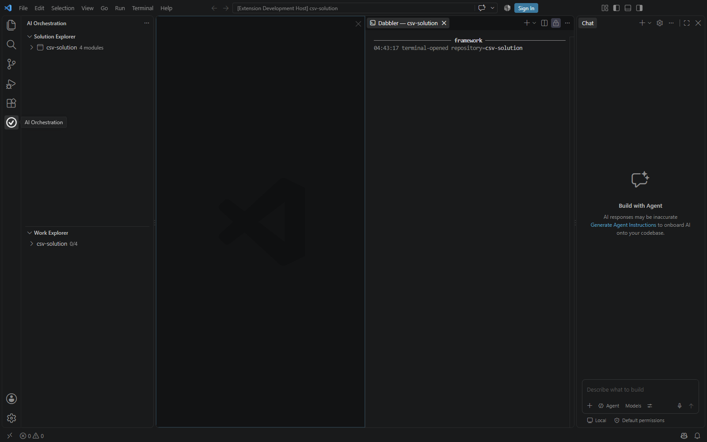
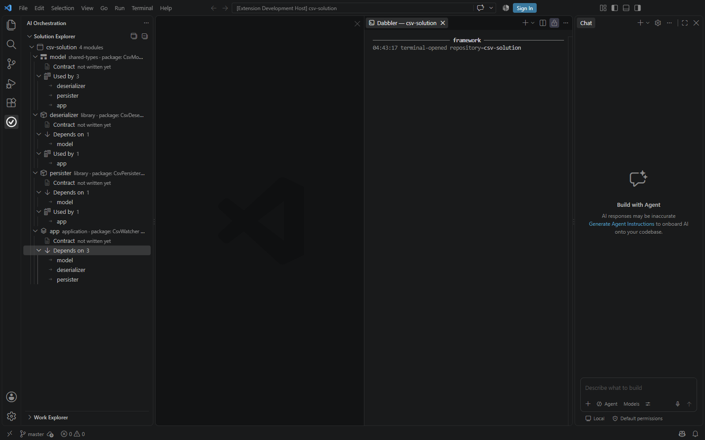
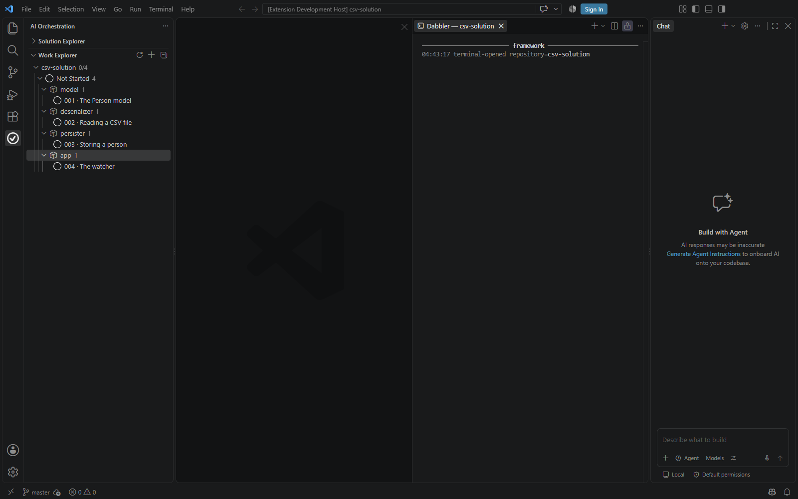
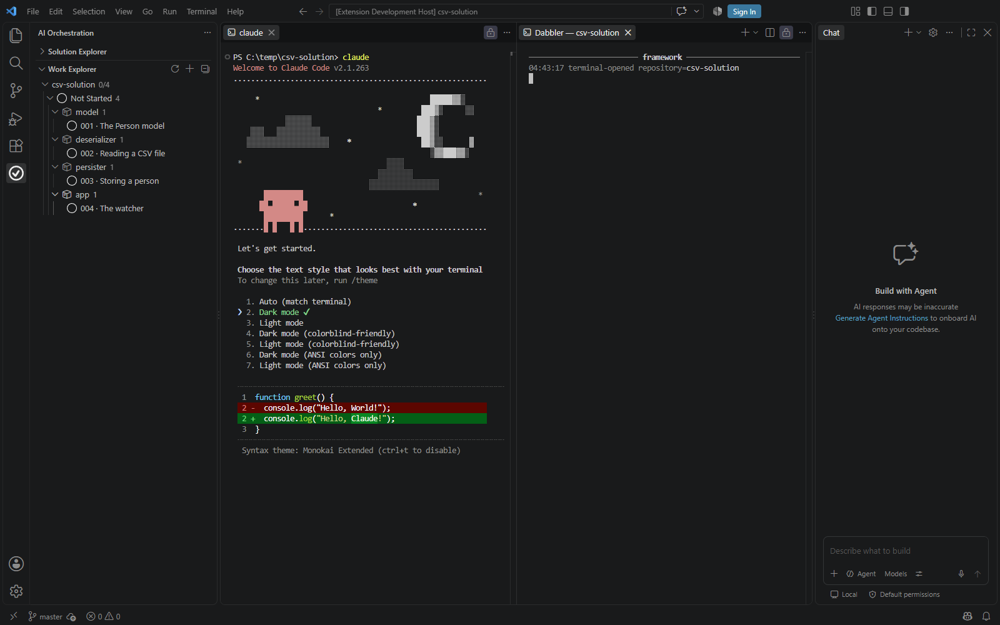

# Building the CSV solution: four modules, one repository

You are going to build a .NET solution that watches a folder for CSV files,
reads each one into `Person` objects, and stores them in a database. You will
build it as **four modules**, each a project and its tests in one solution:
one module is one developer's unit of work.

| Module | Kind | What it is | Package |
| --- | --- | --- | --- |
| `model` | shared-types | The `Person` type every other module references | `CsvModel` |
| `deserializer` | library | CSV text into `Person` objects | `CsvDeserializer` |
| `persister` | library | `Person` objects into a database | `CsvPersister` |
| `app` | application | Watches the folder and composes the other three | `CsvWatcher` |

**A sibling is a project reference.** Each module's project references the
projects of the modules it depends on, and one solution file at the root lists
all four, so `dotnet test` there builds and tests the whole solution in one
pass.

**`examples/csv-walkthrough/` is not this tutorial.** It is Python, built on
the six-step component workflow session 100 deleted, and this document
supersedes it.

Everything below is what you type or click. The framework does the rest.

---

## Before you start

You need .NET 10 or newer, git, and VS Code with the Dabbler extension
installed. Check the SDK:

```
dotnet --list-sdks
```

The `dabbler` command is on `PATH` in any VS Code terminal once the extension
has installed its shim. Everywhere else, run
`node "<extension dir>/dist/dabbler.cjs" <verb>`. If you see
"dabbler: command not found", that is a `PATH` problem, not a keys problem.

---

## 1. Set the repository up

Make an empty folder, open it in VS Code, and click **Set Up New Project** in
the Solution Explorer. It runs `git init` and then `dabbler bootstrap`.

**You should see:** the Solution Explorer changes from its welcome text to a
repository row, and `docs/sessions/session-plan.md` appears.

---

## 2. The four modules are projects

There is nothing to declare. The solution is its build files: each module is a
project under `modules/<name>/src`, with its tests in a project under
`modules/<name>/tests`, and one `.slnx` at the root lists them all. The
Solution Explorer reads them and shows each project with its kind, what it
references and — derived, never typed — what references it.

The sessions write the projects. Once the build files hold more than one
project and the root has no solution file, the framework writes the root build
files as that session's work is done, before it is verified, and **never
rewrites them**: the `.slnx` listing the projects, `Directory.Build.props`
and `Directory.Build.targets`, with `bin/` and `obj/` added to
`.gitignore`.

**A shortcut for a quick look:** `node tools/dabbler-ai-orchestration/scripts/stage-csv-solution.mjs
--root <a folder under C:/temp> --reset` writes the sources and projects for
all four modules, the solution file, and a planned four-session
`docs/sessions/session-plan.md`, in one call. It is what stages the corpus
Section 4 below is a tour of.

---

## 3. Plan one session per module

Append one entry per module to `docs/sessions/session-plan.md`, each naming the
module it works in. The heading form is load-bearing — a session's title is
healed from it, and clicking a row in the Work Explorer lands on it:

```
### Session 1 of 4: The Person model
```

**You should see:** the Work Explorer showing the repository at **0/4**, with
the sessions under a **Not Started** bucket.

---

## 4. Look at what you built

### Open the solution

Open the CSV solution folder in VS Code.
Click the **Dabbler AI Orchestration** icon in the activity bar.

**You should see:**

- Two panes appear: **Solution Explorer** and **Work Explorer**.
- The Solution Explorer names the repository and says **4 modules**.



### Read what the solution is built from

Collapse the Work Explorer and expand the Solution Explorer's repository row, then expand each module.

**You should see:**

- Four modules: **model**, **deserializer**, **persister** and **app**.
- `model` is a **shared-types** module and is **used by 3** siblings — every other module references the `Person` type.
- `deserializer` and `persister` each depend on the model and are used by `app`.
- Each module names its package: `CsvModel`, `CsvDeserializer`, `CsvPersister`, `CsvWatcher`.



### Read what work is planned

Collapse the Solution Explorer and expand the **Work Explorer**.
Expand the repository row, then the **Not Started** bucket.

**You should see:**

- The repository shows **0/4** — none of the four sessions has run.
- The sessions are grouped **by module**, one session per module.
- Each session's title says what that module is for.



### Open the two terminals

Open a terminal in the editor area and start your AI CLI in it.
Run **Dabbler: Show Framework Terminal** from the command palette.

**You should see:**

- Two editor tabs side by side: the **AI CLI on the left**, the **Dabbler terminal on the right**.
- This is the default. `dabbler.terminalLocation` is `editor`, which puts the CLI in the first editor column and the framework terminal beside it. Set it to `panel` if you would rather they were panel terminals.
- The Dabbler terminal prints the framework's own work, and nothing the CLI says.



---

## 5. Work the model module first

`model` is first because every other module references its project.

Press **Start Session**. Choose your engine, and the
extension opens two editor tabs side by side — your **AI CLI on the left** and
the **Dabbler terminal on the right**, exactly the layout Section 4 showed —
that is the default; set `dabbler.terminalLocation` to `panel` if you would
rather they were panel terminals.

Then let the framework drive. In the CLI, run what the sentence in the terminal
tells you, once:

```
dabbler session start --sessions-dir docs/sessions --engine <your engine> --provider <your provider>
dabbler session next --sessions-dir docs/sessions
```

and keep calling `next`, doing what each instruction says, until it says
`done`. **One call, one move.** You never run the tests, the verification, the
commit or the close yourself — the framework does each of those between your
calls, and the Dabbler terminal narrates them.

**You should see:** in the Work Explorer, session 001 moving into an **In
Progress** bucket with six lifecycle rows underneath it — Register, Plan,
Work, Verify, Test, Close — and the Dabbler terminal printing each phase as it
starts. The engine's own plan for the session nests under **Work**, as its own
steps.

---

## 6. Change the model, and see who breaks

Once all four modules exist, expand **CsvModel** in the Solution Explorer and
open **Used by**.

**You should see** every project that references it, directly or through
another: `CsvDeserializer`, `CsvPersister`, their test projects and
`CsvWatcher`. Nobody typed that list. It is read from the
`<ProjectReference>` elements, and it is the list a change to `Person` can
break.

One `dotnet test` at the root proves they still build against the change,
because the solution file lists every project, and it is the session's run of
record: every expensive suite runs once the session's work is verified.

---

## 7. Build and run the whole thing

Run the application. Its project references build the other three with it:

```
dotnet run --project modules/app/src/CsvWatcher -- ./inbox ./people.db
```

Drop a CSV into `./inbox`:

```
FirstName,LastName,Email,HiredOn
Ada,Lovelace,ada@example.com,1843-01-05
Grace,Hopper,grace@example.com,1944-07-02
```

**You should see:** `people-clean.csv: read 2, stored 2, total 2`. Copy the same
file in again and you should see `read 2, stored 0, total 2` — email is the
natural key, so re-reading one file does not duplicate anyone. A file with a
header the reader does not recognise is **refused by name and left alone**,
never half-stored.

---

## What to check when something looks wrong

- **The Solution Explorer says "It fills in once the repository is set up" but
  you have project files.** The projection under
  `.dabbler/solution/solution.json` has not been derived. Touch a `.csproj`
  or the `.slnx`, or run the explicit refresh, and it fills in.
- **The framework stopped.** Read its own account first —
  `dabbler status`, the `stop` on `.dabbler/runs/s<N>/driver/run.json`, and the
  outstanding instruction's `reasons`. Never edit a record, a verdict or a gate
  to get past a stop.
