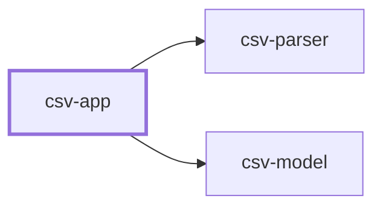

# Contract — `csv-app`

**Version 1.0.0**  
What a person at a terminal sees. Reads a path, uses the parser, reports the counts. Owns presentation and nothing else.

## Where it sits

**Used by:** nothing yet — these break if this contract changes.

## What it promises

### `main(argv)`

Reads the file named on the command line and reports on it.

| | | Proved by |
| --- | --- | --- |
| **Must be true going in** What the caller guarantees before the call. | argv carries exactly one path. | `test_requires_exactly_one_path` |
| **Guaranteed coming out** What the component guarantees when it returns. | Prints the number of records read and the number of rows rejected. Prints each rejection as its line number followed by the parser's reason, passed through unchanged. The app does not interpret, shorten or re-word it. Exits 0 when nothing was rejected, 1 when anything was. | `test_prints_both_counts` `test_reason_reaches_the_output_unchanged` `test_exit_zero_only_when_nothing_rejected` |
| **Kept on purpose** Deliberately *not* removed or altered. The part people forget. | The non-zero exit on any rejection. This is the app's answer to the plan's partial-failure question -- it is the caller that checks the rejection list rather than ignoring it, and scripts depend on it. | `test_any_rejection_exits_non_zero` |
| **Side effects** Anything that changes besides the return value. | *none stated* | *nothing to prove* |
| **How it fails** Including whether failure is a normal outcome. | A wrong header or bad encoding prints the parser's message and exits 2, distinguishing "this file is not usable" from "some rows failed". | `test_unusable_file_exits_two` |

> **Not promised.** The layout of the printed output. It is for people and it will change. · The wording of any rejection reason. csv-parser does not promise that wording, so this app cannot promise it either -- passing text through unchanged is a promise about this app, not about the text. · That exit codes beyond 0, 1 and 2 stay unused.
>
> Callers must not depend on any of this. Pinning it in a test freezes an implementation detail, so an improvement then looks like a break — and a check that cries wolf gets switched off.

---

*Generated from the contract definition. Do not edit by hand — regenerate with `python -m ai_router.contractdoc`.*
