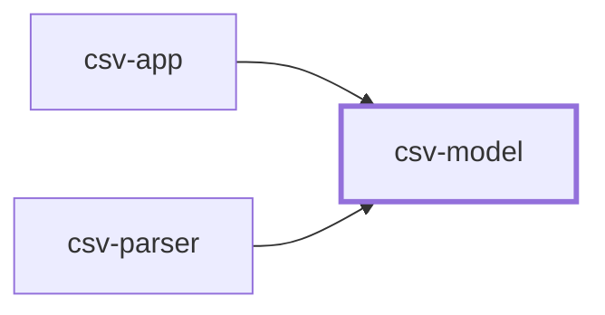

# Contract — `csv-model`

**Version 1.0.0**  
The record a valid CSV row becomes, and the rules that decide whether a row can become one. Knows nothing about files, commas, or headers.

## Where it sits

**Used by:** `csv-app`, `csv-parser` — these break if this contract changes.

## What it promises

### `PersonRecord(name, email, age, active)`

A complete person. There is no partly-filled record.

| | | Proved by |
| --- | --- | --- |
| **Must be true going in** What the caller guarantees before the call. | name: non-empty once surrounding spaces are removed email: exactly one '@', neither first nor last character age: whole number, 0 <= age <= 150 active: already true or false, decided by the caller | `test_rejects_blank_name` `test_rejects_email_without_one_interior_at` `test_rejects_age_outside_zero_to_150` |
| **Guaranteed coming out** What the component guarantees when it returns. | Every field is populated; no field is ever null or missing. Fields are read-only once the record exists. | `test_every_field_is_populated` |
| **Kept on purpose** Deliberately *not* removed or altered. The part people forget. | The four field names, in this order. Everything that needs to know the column order reads FIELDS from here rather than repeating it. | `test_fields_lists_the_four_names_in_order` |
| **Side effects** Anything that changes besides the return value. | *none stated* | *nothing to prove* |
| **How it fails** Including whether failure is a normal outcome. | Any precondition violated raises InvalidField, naming the field and the value rejected. Callers catch this per row; it is a normal outcome, not a bug. | `test_invalid_field_names_the_field_and_value` |

> **Not promised.** The exact wording of a rejection reason. It is written for people and it will be reworded. · That PersonRecord stays a class rather than becoming something else with the same four readable fields.
>
> Callers must not depend on any of this. Pinning it in a test freezes an implementation detail, so an improvement then looks like a break — and a check that cries wolf gets switched off.

### `check_field(field, raw)`

The one place a field's rule lives, so the parser and the record cannot disagree about what valid means.

| | | Proved by |
| --- | --- | --- |
| **Must be true going in** What the caller guarantees before the call. | field is one of: name, email, age, active raw is the text as it appeared in the file, spaces included | `test_unknown_field_name_is_rejected` |
| **Guaranteed coming out** What the component guarantees when it returns. | Surrounding spaces are removed before any rule is applied. active accepts true/false/yes/no/1/0 in any case; true, yes and 1 mean true, the rest mean false Returns the cleaned, converted value ready to put in a record. | `test_surrounding_spaces_are_removed_first` `test_active_accepts_every_declared_spelling` |
| **Kept on purpose** Deliberately *not* removed or altered. The part people forget. | *none stated* | *nothing to prove* |
| **Side effects** Anything that changes besides the return value. | None. No input, no output, no globals, no clock. | `test_check_field_touches_nothing_outside_itself` |
| **How it fails** Including whether failure is a normal outcome. | InvalidField, carrying a one-sentence reason fit to show a person. | `test_reason_is_one_sentence` |

> **Not promised.** That checking is the only validation that will ever exist. · Any ordering guarantee between fields beyond the declared check order.
>
> Callers must not depend on any of this. Pinning it in a test freezes an implementation detail, so an improvement then looks like a break — and a check that cries wolf gets switched off.

---

*Generated from the contract definition. Do not edit by hand — regenerate with `python -m ai_router.contractdoc`.*
