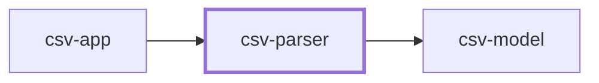

# Contract — `csv-parser`

**Version 1.1.0**  
Turns CSV text into records and rejections. Owns everything about the file format -- the delimiter, the header rule, blank lines -- and nothing about what a person is.

## Where it sits

**Used by:** `csv-app` — these break if this contract changes.

## What it promises

### `read_people(path)`

Reads one file and returns the records and the rejections together, as one result carrying both.

| | | Proved by |
| --- | --- | --- |
| **Must be true going in** What the caller guarantees before the call. | path names a readable file, decoded as UTF-8. A leading byte-order mark is removed before anything else reads it. The first non-empty line is the header and must be exactly the four names from csv-model.FIELDS, in order, compared case-sensitively. Any blank lines before it are skipped and counted. | `test_byte_order_mark_is_stripped` `test_header_match_is_case_sensitive` |
| **Guaranteed coming out** What the component guarantees when it returns. | Returns records and rejections. Both are always present; an empty rejection list is a real answer, not an absent one. Rejections carry the line number counted from the start of the file, the raw line, and one sentence saying what was wrong. Rejections are in file order. A row is checked field by field in csv-model.FIELDS order and stops at the first problem, so the reason names one field. Any blank line is skipped, counted as neither a record nor a rejection, whether it falls before or after the header. The reading reports how many blank lines were skipped and which line the header was found on, because a caller cannot otherwise account for the file. records + rejections + blank lines + 1 header == total lines. This is an invariant, not a summary: it holds for every file this accepts, and blank lines before the header are inside the count. | `test_records_and_rejections_both_returned` `test_rejection_carries_line_number_and_raw_line` `test_first_bad_field_in_order_is_the_reported_one` `test_blank_lines_are_skipped_wherever_they_fall` `test_every_line_is_accounted_for_including_before_the_header` `test_reading_reports_blank_count_and_header_line` |
| **Kept on purpose** Deliberately *not* removed or altered. The part people forget. | Skip-and-report. A bad row never fails the file. Changing this would silently change what every caller receives. The line number counts physical lines, including blank ones, so it always points at what an editor shows. | `test_one_bad_row_does_not_fail_the_file` `test_line_numbers_count_blank_lines` |
| **Side effects** Anything that changes besides the return value. | *none stated* | *nothing to prove* |
| **How it fails** Including whether failure is a normal outcome. | A wrong header raises BadHeader naming the columns found instead. This is the one fatal outcome, because a caller handed an empty result cannot tell a wrong file from an empty one. A file that is not valid UTF-8 raises BadEncoding. | `test_bad_header_names_the_columns_found` `test_invalid_utf8_raises_bad_encoding` |

> **Not promised.** Quoted fields containing commas or newlines. Out of scope by the plan. · Any delimiter other than a comma. · That rejection reasons keep their current wording.
>
> Callers must not depend on any of this. Pinning it in a test freezes an implementation detail, so an improvement then looks like a break — and a check that cries wolf gets switched off.

---

*Generated from the contract definition. Do not edit by hand — regenerate with `python -m ai_router.contractdoc`.*
