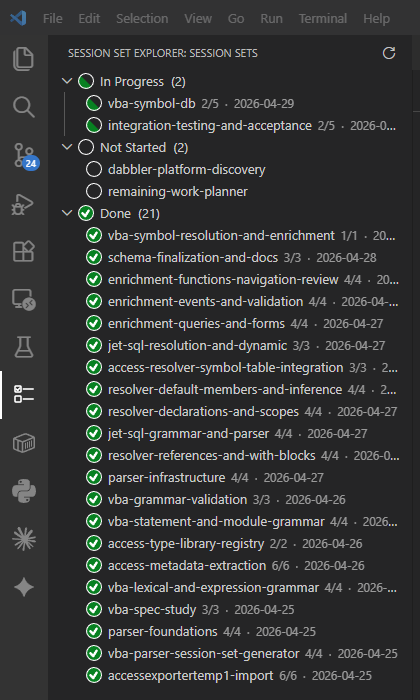

# Dabbler AI Orchestration

An AI-led workflow extension for VS Code. Manage structured AI coding sessions, scaffold new projects, track session-set state across git worktrees, and monitor cumulative API costs — all from the activity bar.



## Features

### Session Set Explorer
A live tree view of your project's session sets, grouped by state:

- **In Progress** — sessions the AI is currently working or that have started
- **Not Started** — specs ready to run
- **Done** — completed and merged session sets
- **Cancelled** — sets the operator has paused or abandoned (only renders when at least one cancelled set exists)

State is read from `session-state.json` in each
`docs/session-sets/<slug>/` folder. The file's `status` field is the
canonical signal, and the extension consults it directly:

| `status` value | State group |
|---|---|
| `"not-started"` | Not started |
| `"in-progress"` | In Progress |
| `"complete"` | Done |
| `"cancelled"` | Cancelled |

Cancellation has its own on-disk marker that always wins over the
status field: a `CANCELLED.md` file in the session-set folder forces
the set into the Cancelled group regardless of any other signal,
including a `change-log.md` from a partial close-out. Detection
precedence (highest first): `CANCELLED.md` → `change-log.md` (done)
→ `activity-log.json` or `session-state.json` (in-progress) →
otherwise not-started.

Every session-set folder is expected to carry a `session-state.json`
from creation onward. For legacy folders that predate this invariant,
the extension falls back to file-presence inference (`change-log.md` →
done, `activity-log.json` → in-progress, neither → not-started) and
synthesizes the state file lazily on first read. Run `python -m
ai_router.backfill_session_state` after pulling new repos to
materialize the file for every folder up front.

Right-click a session set to open its spec, activity log, change log, or AI assignment. Copy trigger phrases to start the next AI session. The right-click menu also exposes the cancel/restore lifecycle actions:

- **Cancel Session Set** — visible on in-progress, not-started, and done items. Confirms via a modal, optionally prompts for a reason, writes `CANCELLED.md` to the folder, and refreshes the view so the set jumps to the Cancelled group.
- **Restore Session Set** — visible on cancelled items. Confirms via a modal, renames `CANCELLED.md` to `RESTORED.md`, and the set returns to whichever underlying state its other files indicate (done if `change-log.md` is present, in-progress if `activity-log.json` is, otherwise not-started).

`RESTORED.md` is an audit artifact, not a separate state — the file accumulates the full toggle history across multiple cancel/restore cycles. The same on-disk shape works without the extension: dropping a `CANCELLED.md` file into a session-set folder is sufficient to mark it cancelled. See [the workflow doc's "Cancelling and restoring a session set" section](../../docs/ai-led-session-workflow.md) for the full operator-facing lifecycle.

Each session-set row carries small badges in its description:

- `[FIRST]` / `[LAST]` — the spec's `outsourceMode` (whether verifications go through a synchronous API call or via the persistent provider queue). See [Outsource modes](#outsource-modes) below.
- `[UAT N]` / `[UAT done]` — UAT checklist progress (only on sets with `requiresUAT: true`).

### Provider Queues
A tree view that shows the live state of each provider's outsource-last queue (`provider-queues/<provider>/queue.db`). Messages are bucketed by lifecycle state — `new` → `claimed` → `completed` → `failed` → `timed_out` — and grouped by provider. Right-click a message for **Open Payload**, **Mark Failed**, or **Force Reclaim** (the last two confirm before mutating). Auto-refreshes every 15 seconds (configurable).

The view shells out to `python -m ai_router.queue_status --format json`. The Python helper is the single source of truth for the queue schema; the extension never opens the SQLite file directly.

### Provider Heartbeats
A tree view that shows when each provider last produced a completion and how much it has produced over a sliding window:

```
Provider Heartbeats          Observational only. Subscription windows are not introspectable.
├── anthropic   last seen 12 min ago · 3 completions / 60m   ⚡
├── openai      last seen 2 min ago  · 8 completions / 60m   ⚡
└── google      last seen 3h 22m ago · 0 completions / 60m   ⚠️
```

> **Read this once.** The heartbeats view is **strictly backward-looking**. It cannot tell you whether a provider has subscription headroom, whether the next call will be rate-limited, or whether a quiet provider is healthy or stuck. Use it as a heartbeat — _is anything coming out of this provider lately?_ — and nothing more. The view's description footer repeats this disclaimer at all times.

A provider is flagged silent (⚠️) when its last completion was more than `dabblerProviderHeartbeats.silentWarningMinutes` ago (default 30). Auto-refreshes every 15 seconds (configurable).

The view shells out to `python -m ai_router.heartbeat_status --format json`.

### Outsource modes

Specs may set `outsourceMode: first | last` in their `Session Set Configuration` block:

- **`first`** (default) — verifications run via a synchronous API call to the chosen provider. Familiar, simple, blocks the session until done.
- **`last`** — verifications enqueue to the provider's queue and return immediately; a separate verifier-role daemon drains the queue. Use for long-running verifications or when you want to keep multiple verifications in flight.

When `outsourceMode` is omitted from a spec, the extension treats it as `first` for backward compat.

### Project Wizard (`Dabbler: Get Started`)
An onboarding panel that walks you through the entire workflow: prerequisites, how sessions work, and first steps. Opens automatically in new workspaces.

### New Project Scaffolding (`Dabbler: Set Up New Project`)
Initializes a git repository and creates the standard folder layout (`docs/session-sets/`, `docs/planning/`, `ai-router/`). Optionally sets up git worktrees for parallel session execution.

### Plan Import & Session-Set Generation
- **`Dabbler: Import Project Plan`** — import a Markdown plan file or get a prompt to generate one with AI.
- **`Dabbler: Generate Session-Set Prompt`** — builds and copies an AI prompt that translates your plan into a sequence of session-set specs.

### Cost Dashboard (`Dabbler: Show Cost Dashboard`)
Reads `ai-router/metrics.jsonl` and displays:
- Cumulative project total
- Per-session-set breakdown (sessions run, total cost, last run date)
- 30-day ASCII sparkline chart
- Model mix (% of spend by model)
- CSV export

### Troubleshooting (`Dabbler: Troubleshoot`)
A guided QuickPick that diagnoses common issues: activation, stuck sessions, git worktrees, API key setup, high costs, and folder layout.

## Requirements

- VS Code 1.85 or later
- Git on your PATH
- Python ≥ 3.10 with the `ai-router` module (for running sessions)
- At least one API key: `ANTHROPIC_API_KEY`, `OPENAI_API_KEY`, or `GEMINI_API_KEY`

## Cost reality — please read before adopting

This workflow is **not free**, and the costs are worth understanding up front.

The orchestration does try to contain costs. For each session it picks the
least expensive model that's capable of the job, and calibrates the effort
level (low / normal / high) accordingly. But the workflow also routinely
farms work out — including end-of-session verification tasks that may run on
a different (often more expensive) model than the session itself, to give
you cross-provider review.

For a small or short-lived project, the total cost is usually modest. For
**larger projects that span many days or weeks** — multiple session sets,
many sessions per set, plus verification on each — the cumulative spend can
get **significant**. It's not unusual for an active project to run into the
tens or low hundreds of dollars over its lifetime.

The author finds the tradeoff worth it: the workflow ships features faster
and at higher quality than working solo. But this isn't a tradeoff everyone
should make. In particular, **if you're doing volunteer or open-source work
and you're not independently wealthy, please look at the cost dashboard
early and often** — it's easy to underestimate how quickly per-session costs
add up across an active project.

Use `Dabbler: Show Cost Dashboard` after every few sessions until you have
calibrated intuition for what your typical project costs. Set a personal
budget. Stop if you're not comfortable with the rate of spend.

## Extension Settings

| Setting | Default | Description |
|---|---|---|
| `dabblerSessionSets.uatSupport.enabled` | `auto` | Show UAT commands: `auto` (when any spec declares `requiresUAT: true`), `always`, `never` |
| `dabblerSessionSets.e2eSupport.enabled` | `auto` | Show E2E commands: `auto`, `always`, `never` |
| `dabblerSessionSets.e2e.testDirectory` | `tests` | Root directory to search for Playwright test files |
| `dabblerProviderQueues.autoRefreshSeconds` | `15` | Auto-refresh interval for the Provider Queues view (`0` disables) |
| `dabblerProviderQueues.pythonPath` | `python` | Python executable used for `queue_status` / `heartbeat_status`; relative paths resolve against the workspace root |
| `dabblerProviderQueues.messageLimit` | `50` | Max messages fetched per provider per refresh |
| `dabblerProviderHeartbeats.autoRefreshSeconds` | `15` | Auto-refresh interval for the Provider Heartbeats view (`0` disables) |
| `dabblerProviderHeartbeats.lookbackMinutes` | `60` | Lookback window for completion / token counts (observational only) |
| `dabblerProviderHeartbeats.silentWarningMinutes` | `30` | Silent-provider warning threshold |

## Git Worktree Support

The extension automatically discovers all worktrees for each workspace folder via `git worktree list`. Session sets from multiple worktrees are merged: when the same slug appears in more than one worktree, the higher-state version wins (done > in-progress > not-started), with ties broken by most-recent `lastTouched` timestamp.

## Cost Metrics Format

Enable `METRICS_ENABLED = True` in `ai-router/config.py`. Each session appends one JSON line to `ai-router/metrics.jsonl`:

```json
{
  "session_set": "my-feature",
  "session_num": 3,
  "model": "claude-sonnet-4-6",
  "effort": "normal",
  "input_tokens": 12400,
  "output_tokens": 3200,
  "cost_usd": 0.34,
  "timestamp": "2026-04-29T14:23:00Z"
}
```

## Session Set Configuration Block

Add this block to `spec.md` to enable UAT/E2E features for that session set:

````markdown
## Session Set Configuration
```yaml
totalSessions: 3
requiresUAT: true
requiresE2E: false
effort: normal
outsourceMode: first
```
````

## Building from Source

```bash
cd tools/dabbler-ai-orchestration
npm install
npm run compile    # one-shot build
npm run watch      # incremental watch build
npm run package    # produces a .vsix for local install
npm test           # compile + run tests
```

## Links

- [darndestdabbler.org](https://darndestdabbler.org)
- [Report an issue](https://github.com/darndestdabbler/dabbler-ai-orchestration/issues)
- [Workflow documentation](../../docs/ai-led-session-workflow.md)
